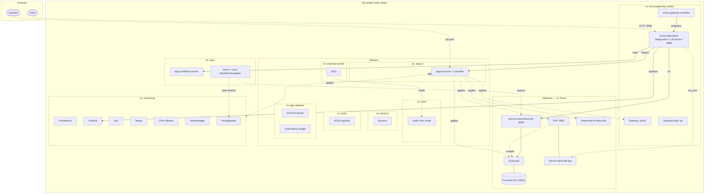
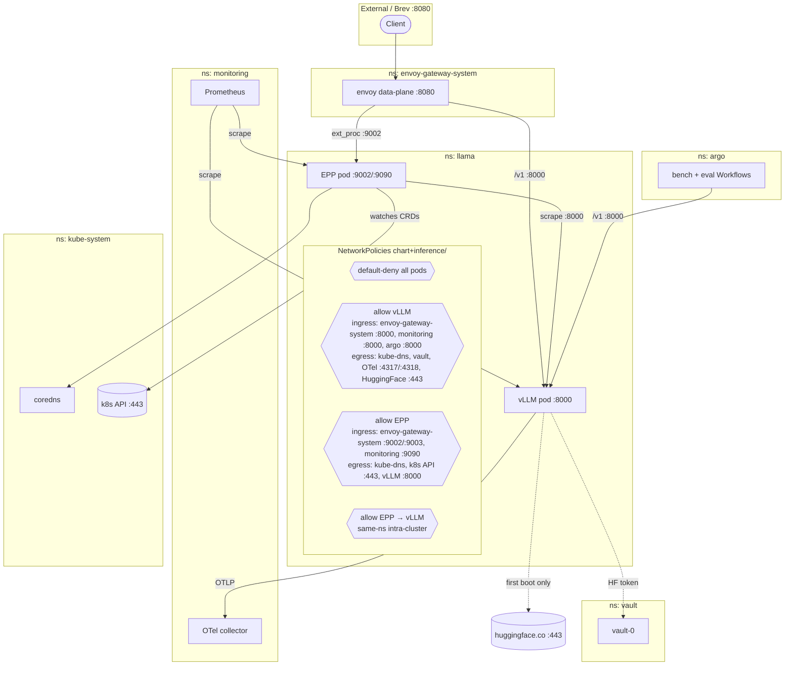

# inference-reliability-platform

A **Brev launchable** that stands up a production-shape vLLM inference
platform on a single-GPU Kubernetes node — GitOps, KV-cache-aware
routing, autoscaling, observability, policy enforcement, evals, load
tests, CI. **The design goal is inference reliability.**

One command bootstraps the whole stack. What you get:

- **vLLM** v0.7.3 serving Meta-Llama-3-8B-Instruct behind an OpenAI-compatible API
- **Envoy Gateway** + **Gateway API Inference Extension** (EPP) — KV-cache-aware routing
- **ArgoCD** GitOps with 24 Applications and sync-wave ordering
- **KEDA** autoscaling on `vllm:num_requests_waiting`
- **NVIDIA GPU Operator** + **DCGM** exporter for hardware telemetry
- **Kyverno** — 8 admission-time guardrails (runtime class, `/dev/shm`, priority, resources)
- **HashiCorp Vault** + **External Secrets Operator** for credentials
- **Prometheus + Grafana + Loki + Tempo + OTel Collector + Alertmanager**
- **6 Grafana dashboards** — vLLM, GPU, gateway, cost, load tests, model quality
- **27 Prometheus alerts** — SLO burn-rate, GPU health, model quality
- **Argo Workflows** — nightly load-test suite + 6-hourly model quality eval
- **GitHub Actions** — yamllint, helm-unittest, kubeconform, kyverno-test, pytest, kind e2e

## Documentation

Deep dives per component live in [`docs/`](docs/). Start with:

- [`docs/01-architecture.md`](docs/01-architecture.md) — namespaces, request path, versions
- [`docs/02-reliability.md`](docs/02-reliability.md) — how every layer contributes to inference reliability
- [`docs/20-making-inference-reliable.md`](docs/20-making-inference-reliable.md) — design essay: the seven reliability axes for LLM serving

Component-by-component:

| Doc | Topic |
|-----|-------|
| [03-bootstrap-and-gitops](docs/03-bootstrap-and-gitops.md) | ArgoCD install, sync waves, root app |
| [04-kubernetes](docs/04-kubernetes.md) | Cluster shape, RuntimeClass, priority, network policy |
| [05-gpu-operator](docs/05-gpu-operator.md) | GPU Operator, DCGM, `/dev/shm` gotchas |
| [06-inference-vllm](docs/06-inference-vllm.md) | `charts/llama-8b` — every value, probe, PVC, rollout gate |
| [07-inference-extension-epp](docs/07-inference-extension-epp.md) | InferencePool + Endpoint Picker |
| [08-gateway-envoy](docs/08-gateway-envoy.md) | GatewayClass, HTTPRoutes, ratelimit, ext_proc |
| [09-keda-autoscaling](docs/09-keda-autoscaling.md) | ScaledObject, Prometheus trigger |
| [10-secrets-eso-vault](docs/10-secrets-eso-vault.md) | ClusterSecretStore, ExternalSecrets, rotation |
| [11-kyverno-policies](docs/11-kyverno-policies.md) | Every ClusterPolicy explained |
| [12-observability](docs/12-observability.md) | Prom + Grafana + Loki + Tempo + OTel + Alertmanager |
| [13-dashboards](docs/13-dashboards.md) | One section per dashboard |
| [14-alerts](docs/14-alerts.md) | Every alert with condition, threshold, runbook |
| [15-loadtests](docs/15-loadtests.md) | Nightly suite, adapting for your workload |
| [16-evals](docs/16-evals.md) | Model quality eval — prompts, evaluator, metrics |
| [17-ci-cd](docs/17-ci-cd.md) | `ci.yml` + `e2e.yml` |
| [18-operations](docs/18-operations.md) | Day-2 runbook, incident triage per alert |
| [19-extending](docs/19-extending.md) | Add a model, scale multi-GPU, swap components |

Screenshots of the running platform (Grafana dashboards, Alert rules,
ArgoCD Applications view) are embedded in the docs above and archived
in [`images/screenshots/`](images/screenshots/).

## Architecture

Diagrams live in [`images/`](images/) as Mermaid source (`.mmd`) — the
blocks below are rendered inline by GitHub. Keep the `.mmd` file and
the inline copy in sync.

### Kubernetes infrastructure



The end-to-end **inference request path** (Envoy Gateway → EPP → vLLM
→ GPU → telemetry) is documented in
[`docs/07-inference-extension-epp.md`](docs/07-inference-extension-epp.md#inference-request-path)
where the EPP wiring is explained alongside it.

### Networking / NetworkPolicy topology



## Repository layout

```
.github/         GitHub Actions CI (yamllint, helm-unittest, kubeconform, kyverno, kind e2e)
alerts/          PrometheusRule SLO + GPU + model-quality alerts
apps/            ArgoCD Applications (app-of-apps)
bootstrap/       ArgoCD install + root app + Vault seed
charts/llama-8b/ vLLM Helm chart
dashboards/      Grafana dashboard ConfigMaps
docs/            Component-by-component documentation
evals/           Model-quality prompts + Argo CronWorkflow
gateway/         Envoy Gateway resources (GatewayClass, Gateway, EnvoyProxy)
httproutes/      HTTPRoutes and traffic policies
images/          Architecture diagrams (Mermaid source)
inference/       Gateway API Inference Extension — EPP + InferencePool
loadtests/argo/  Argo WorkflowTemplates for benchmark suite + CLI toolbox
policies/        Kyverno ClusterPolicies
secrets/         ClusterSecretStore + ExternalSecrets
```

Sync waves: `-6` gateway-api-crds → `-4` envoy-gateway →
`-3` inference-extension-crds → `-2` gateway → `0` gpu-operator, vault,
external-secrets, kube-prometheus-stack, loki, tempo → `3` kyverno, keda →
`5` secrets, otel-collector, dashboards, alerts, argo-workflows,
pushgateway → `7` policies → `10` llama → `11` httproutes,
inference-extension → `12` evals → `20` loadtests.

Details: [`docs/03-bootstrap-and-gitops.md`](docs/03-bootstrap-and-gitops.md).

## Quickstart

### 1. Host prep

```bash
nvidia-smi
curl -sfL https://get.k3s.io | sh -
curl -fsSL https://raw.githubusercontent.com/helm/helm/main/scripts/get-helm-3 | bash

mkdir -p ~/.kube
sudo cp /etc/rancher/k3s/k3s.yaml ~/.kube/config
sudo chown $(id -u):$(id -g) ~/.kube/config
export KUBECONFIG=~/.kube/config
echo 'export KUBECONFIG=~/.kube/config' >> ~/.bashrc
kubectl get nodes
```

Install NVIDIA container toolkit so k3s picks up the `nvidia` runtime:

```bash
curl -fsSL https://nvidia.github.io/libnvidia-container/gpgkey | \
  sudo gpg --dearmor -o /usr/share/keyrings/nvidia-container-toolkit-keyring.gpg
curl -s -L https://nvidia.github.io/libnvidia-container/stable/deb/nvidia-container-toolkit.list | \
  sed 's#deb https://#deb [signed-by=/usr/share/keyrings/nvidia-container-toolkit-keyring.gpg] https://#g' | \
  sudo tee /etc/apt/sources.list.d/nvidia-container-toolkit.list
sudo apt-get update && sudo apt-get install -y nvidia-container-toolkit

# Legacy mode + volume-mount device discovery (avoids CDI segfault on driver <570)
sudo nvidia-ctk config --in-place \
  --set nvidia-container-runtime.mode=legacy \
  --set accept-nvidia-visible-devices-as-volume-mounts=true \
  --set accept-nvidia-visible-devices-envvar-when-unprivileged=false
sudo systemctl restart k3s
```

Details: [`docs/04-kubernetes.md`](docs/04-kubernetes.md),
[`docs/05-gpu-operator.md`](docs/05-gpu-operator.md).

### 2. Bootstrap

```bash
export GITHUB_TOKEN=ghp_...
export GITHUB_USER=framsouza
export REPO_URL=https://github.com/framsouza/inference-reliability-platform.git
export HF_TOKEN=hf_...
./bootstrap/install.sh
```

`install.sh` installs ArgoCD, waits for Vault, seeds `secret/hf`,
`secret/github`, `secret/vllm`, then force-syncs the ExternalSecrets.
ArgoCD picks up 24 Applications and rolls out the rest.

**Vault pod restarted?** Dev mode is in-memory — re-seed with
`./bootstrap/seed-vault.sh` (idempotent).

Details: [`docs/03-bootstrap-and-gitops.md`](docs/03-bootstrap-and-gitops.md),
[`docs/10-secrets-eso-vault.md`](docs/10-secrets-eso-vault.md).

### 3. Verify

```bash
kubectl -n argocd get applications
kubectl -n gpu-operator get pods
kubectl -n llama get externalsecret,secret,pods
```

## Access

Envoy Gateway listens on **port 8080**. Publish it in Brev; every UI and
API is exposed by path:

| Path       | Backend                         | Purpose                        |
|------------|---------------------------------|--------------------------------|
| `/v1`      | `llama-llama-8b` (llama)        | vLLM OpenAI-compatible API     |
| `/argocd`  | `argocd-server` (argocd)        | ArgoCD UI                      |
| `/grafana` | `kps-grafana` (monitoring)      | Grafana dashboards + Explore   |
| `/argo`    | `argo-workflows-server` (argo)  | Argo Workflows UI              |

```bash
kubectl -n envoy-gateway-system get svc | grep public
# EXTERNAL-IP is the node IP; port 8080 is bound on the host via klipper-lb
```

Then in a browser: `http://<node-ip>/argocd`, `/grafana`, `/argo`.

### Hit the model

```bash
export VLLM_API_KEY=$(kubectl -n llama get secret vllm-api-key \
  -o jsonpath='{.data.token}' | base64 -d)

curl -X POST http://<node-ip>/v1/chat/completions \
  -H "content-type: application/json" \
  -H "Authorization: Bearer ${VLLM_API_KEY}" \
  -d '{"model":"meta-llama/Meta-Llama-3-8B-Instruct",
       "messages":[{"role":"user","content":"hi"}]}'
```

Default credentials:

| Service         | Login                                                                                                    |
|-----------------|----------------------------------------------------------------------------------------------------------|
| ArgoCD          | `admin` / `kubectl -n argocd get secret argocd-initial-admin-secret -o jsonpath='{.data.password}' \| base64 -d` |
| Grafana         | `admin` / `admin`                                                                                        |
| Prometheus      | no auth (not routed through gateway; port-forward for access)                                            |
| Argo Workflows  | no auth (chart deployed with `--auth-mode=server`)                                                       |
| vLLM            | Bearer token from `vllm-api-key` Secret (see command above)                                              |

Details: [`docs/08-gateway-envoy.md`](docs/08-gateway-envoy.md).

## Reliability at a glance

Every layer of this platform is oriented toward keeping a single GPU
serving traffic reliably. See [`docs/02-reliability.md`](docs/02-reliability.md)
for the story; [`docs/20-making-inference-reliable.md`](docs/20-making-inference-reliable.md)
for the wider design essay.

| Concern | Mechanism |
|---------|-----------|
| Requests overwhelming the GPU | Envoy Gateway rate limit + KEDA queue-depth scaling |
| KV cache preemption | Endpoint Picker (EPP) with `vllm:gpu_cache_usage_perc` awareness |
| Missing GPU device injection | Kyverno `mutate-nvidia-runtime-class` |
| PyTorch "Bus error" on `/dev/shm` | Kyverno `require-gpu-pod-shm` (2 GiB) |
| vLLM evicted by other pods | `gpu-inference` PriorityClass + Kyverno enforcement |
| Cold start (16 GB weights) | HF cache PVC + 30-min startup probe |
| Rollout regression | ArgoCD PostSync gate running `benchmark_serving.py` |
| Model quality regression | 6-hourly eval → Pushgateway → Alertmanager |
| Latency SLO breach | Multi-window burn-rate alerts (Google SRE workbook) |
| GPU hardware fault | DCGM XID / ECC / thermal alerts |
| Secret rotation | Vault + ESO 1h reconcile |
| Every change reversible | ArgoCD GitOps with `automated.prune + selfHeal` |

## CI

Two GitHub Actions workflows keep manifests honest — see
[`docs/17-ci-cd.md`](docs/17-ci-cd.md).

- **`ci.yml`** — yamllint, shellcheck, helm-lint, helm-unittest,
  kubeconform, `kyverno test`, pytest for `evaluator.py`,
  mermaid render, ArgoCD Application schema check.
- **`e2e.yml`** — kind cluster, CRD installs, Kyverno enforcement,
  Helm install of `charts/llama-8b`, mutation + validation tests.

## Notes

- vLLM is pinned to `v0.7.3` because newer images (v0.9+) ship PyTorch
  built against CUDA 12.8, which needs driver 570+. On driver 570+, bump
  the tag.
- DCGM Exporter is pinned to `3.3.9-3.6.1-ubuntu22.04` for the same
  reason (newer DCGM 4.x needs driver 570+).
- Vault runs in dev mode — in-memory, restart = re-seed. See
  [`docs/10-secrets-eso-vault.md`](docs/10-secrets-eso-vault.md) for
  the production Vault checklist.
- Prefix caching is disabled in the chart (`enablePrefixCaching: false`)
  because vLLM v0.7.3's implementation is flaky. Flip after upgrading.

## Contributing

- Every change goes through a PR — CI runs on every push.
- Follow the shape of the existing docs: one `docs/NN-<name>.md` per
  component, cross-linked, with an **Extending / operating** section.
- If you add a new component, drop an ArgoCD Application in `apps/`
  with the right sync wave; index it in [`docs/README.md`](docs/README.md).
