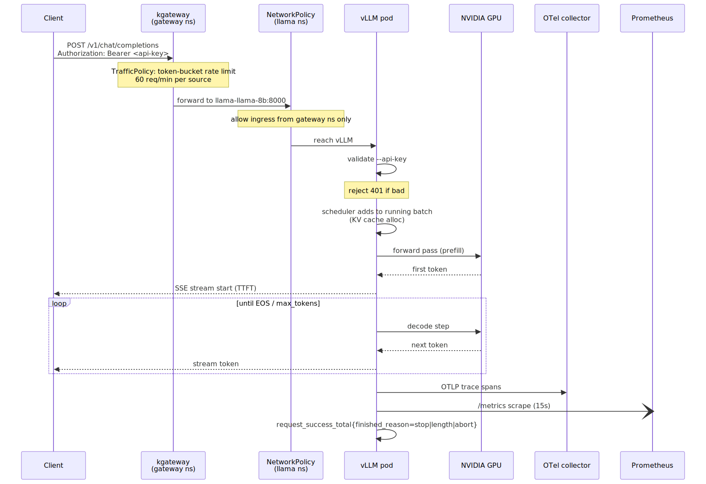

# nvidia-brev-vllm

vLLM serving Llama-3-8B on a single-GPU k3s node. ArgoCD does the deploys, Vault
(dev) + ESO handle secrets.

## Architecture

Diagrams live in [`images/`](images/) — both the Mermaid source (`.mmd`) and
the rendered SVG. To regenerate after editing:
`npx -p @mermaid-js/mermaid-cli mmdc -i images/<name>.mmd -o images/<name>.svg -b white`.

### Kubernetes infrastructure

Namespaces, key controllers, and the control-plane arrows ArgoCD/ESO/kgateway
draw across them.


### Inference request path

What happens on a single `POST /v1/chat/completions` — gateway rate limit,
NetworkPolicy filter, API-key check, batch scheduling, GPU prefill/decode
loop, and the trace/metric side-effects.



### Observability data flow

Metrics, logs, and traces from every source into Prometheus / Loki / Tempo,
then out to Grafana + Alertmanager.



```
.github/         GitHub Actions CI (helm lint, kubeconform, kyverno test, mermaid render)
alerts/          PrometheusRule SLO + GPU + model-quality alerts
apps/            argocd Applications
bootstrap/       argocd install + root app
charts/llama-8b/ vllm helm chart
dashboards/      grafana dashboard ConfigMaps
evals/           model-quality prompts + Argo CronWorkflow
gateway/         kgateway Gateway resource
httproutes/      HTTPRoutes for each backend behind the Gateway
images/          architecture diagrams (mermaid source + rendered svg)
inference/       (reserved) InferencePool + InferenceObjective
loadtests/argo/  Argo WorkflowTemplate for vllm-bench + CLI toolbox
policies/        Kyverno ClusterPolicies (GPU runtime class, ServiceMonitor label…)
secrets/         ClusterSecretStore + ExternalSecrets
```

Sync waves: `-6` gateway-api-crds → `-5` kgateway-crds → `-4` kgateway →
`-2` gateway → `0` gpu-operator, vault, external-secrets,
kube-prometheus-stack, loki, tempo → `3` kyverno, keda → `5` secrets,
otel-collector, dashboards, alerts, argo-workflows, pushgateway →
`7` policies → `10` llama → `11` httproutes → `12` evals → `20` loadtests.

## 1. Host

```bash
nvidia-smi
curl -sfL https://get.k3s.io | sh -
curl -fsSL https://raw.githubusercontent.com/helm/helm/main/scripts/get-helm-3 | bash

mkdir -p ~/.kube
sudo cp /etc/rancher/k3s/k3s.yaml ~/.kube/config
sudo chown $(id -u):$(id -g) ~/.kube/config
export KUBECONFIG=~/.kube/config
echo 'export KUBECONFIG=~/.kube/config' >> ~/.bashrc
kubectl get nodes
```

NVIDIA container toolkit so k3s picks up the `nvidia` runtime:

```bash
curl -fsSL https://nvidia.github.io/libnvidia-container/gpgkey | \
  sudo gpg --dearmor -o /usr/share/keyrings/nvidia-container-toolkit-keyring.gpg
curl -s -L https://nvidia.github.io/libnvidia-container/stable/deb/nvidia-container-toolkit.list | \
  sed 's#deb https://#deb [signed-by=/usr/share/keyrings/nvidia-container-toolkit-keyring.gpg] https://#g' | \
  sudo tee /etc/apt/sources.list.d/nvidia-container-toolkit.list
sudo apt-get update && sudo apt-get install -y nvidia-container-toolkit
```

Pin the toolkit to legacy mode + volume-mount device discovery. Skipping this
step causes pods to fail with `unresolvable CDI devices` or `unknown device`
because gpu-operator's `devicePlugin.env: DEVICE_LIST_STRATEGY=volume-mounts`
needs the runtime to accept device lists via volume mounts, not CDI or env vars.
Required on driver <570 (CDI segfaults):

```bash
sudo nvidia-ctk config --in-place \
  --set nvidia-container-runtime.mode=legacy \
  --set accept-nvidia-visible-devices-as-volume-mounts=true \
  --set accept-nvidia-visible-devices-envvar-when-unprivileged=false
sudo systemctl restart k3s
```

## 2. Bootstrap

Repo is private, so ArgoCD needs a fine-grained PAT (Contents: Read on this
repo). Export both secrets and run the script — it installs ArgoCD, waits for
Vault, seeds `secret/hf` + `secret/github`, and force-syncs the ExternalSecrets.

```bash
export GITHUB_TOKEN=ghp_...
export GITHUB_USER=framsouza
export REPO_URL=https://github.com/framsouza/nvidia-brev-vllm.git
export HF_TOKEN=hf_...
./bootstrap/install.sh
```

The `ExternalSecret` in `secrets/argocd-repo-external-secret.yaml` takes
ownership of the bootstrap-created `repo-nvidia-brev-vllm` Secret once ESO
comes up. From then on, rotating the PAT is a `vault kv put`:

```bash
kubectl -n vault exec -i vault-0 -- sh -c \
  "VAULT_TOKEN=root vault kv put secret/github \
     url='${REPO_URL}' username='${GITHUB_USER}' password='${NEW_TOKEN}'"
kubectl -n argocd annotate externalsecret repo-nvidia-brev-vllm force-sync=$(date +%s) --overwrite
```

Same shape for rotating the HF token via `secret/hf`.

| ExternalSecret          | Vault path      | Target                          |
|-------------------------|-----------------|---------------------------------|
| `hf-token`              | `secret/hf`     | `llama/hf-token`, `argo/hf-token` |
| `vllm-api-key`          | `secret/vllm`   | `llama/vllm-api-key`            |
| `repo-nvidia-brev-vllm` | `secret/github` | `argocd/repo-nvidia-brev-vllm`  |

**Vault pod restarted?** Dev mode is in-memory — re-seed:

```bash
kubectl -n vault rollout status statefulset/vault --timeout=5m
kubectl -n vault exec -i vault-0 -- sh -c \
  "VAULT_TOKEN=root vault kv put secret/hf token='$HF_TOKEN'"
kubectl -n vault exec -i vault-0 -- sh -c \
  "VAULT_TOKEN=root vault kv put secret/github \
     url='$REPO_URL' username='$GITHUB_USER' password='$GITHUB_TOKEN'"
kubectl -n vault exec -i vault-0 -- sh -c \
  "VAULT_TOKEN=root vault kv put secret/vllm apiKey='$VLLM_API_KEY'"
kubectl -n llama  annotate externalsecret hf-token              force-sync=$(date +%s) --overwrite
kubectl -n llama  annotate externalsecret vllm-api-key          force-sync=$(date +%s) --overwrite
kubectl -n argocd annotate externalsecret repo-nvidia-brev-vllm force-sync=$(date +%s) --overwrite
```

## 3. Verify

```bash
kubectl -n argocd get applications
kubectl -n gpu-operator get pods
kubectl -n vault get pods
kubectl -n external-secrets get pods
kubectl -n llama get externalsecret,secret,pods
```

### ArgoCD UI on Brev

`bootstrap/install.sh` already patches `argocd-cmd-params-cm` with
`server.insecure: "true"` (Brev's port publisher is HTTP-only),
`controller.diff.server.side: "true"` (avoids `terminatingReplicas: field not
declared in schema` on k8s ≥1.33), and sets `timeout.reconciliation: 30s` in
`argocd-cm` so a git push turns into a sync within ~30 seconds instead of the
default 3 minutes. Port-forward on port 80:

```bash
kubectl -n argocd port-forward --address 0.0.0.0 svc/argocd-server 8080:80
```

Expose port `8080` in the Brev UI, then hit the Brev-provided URL over
`http://`. Login: `admin` / password from `argocd-initial-admin-secret`
(printed by `bootstrap/install.sh`, or `kubectl -n argocd get secret
argocd-initial-admin-secret -o jsonpath='{.data.password}' | base64 -d`).

If you bootstrapped before these patches were added, run them manually:

```bash
kubectl -n argocd patch configmap argocd-cmd-params-cm --type merge \
  -p '{"data":{"controller.diff.server.side":"true","server.insecure":"true"}}'
kubectl -n argocd patch configmap argocd-cm --type merge \
  -p '{"data":{"timeout.reconciliation":"30s"}}'
kubectl -n argocd rollout restart deploy/argocd-server
kubectl -n argocd rollout restart statefulset/argocd-application-controller
```

DCGM diag:

```bash
kubectl run dcgm-diag --rm -it --restart=Never \
  --image=nvcr.io/nvidia/cloud-native/dcgm:3.3.5-1-ubuntu22.04 \
  --overrides='{"spec":{"runtimeClassName":"nvidia","containers":[{"name":"dcgm-diag","image":"nvcr.io/nvidia/cloud-native/dcgm:3.3.5-1-ubuntu22.04","command":["dcgmi","diag","-r","2"],"resources":{"limits":{"nvidia.com/gpu":1}}}]}}'
```

## Reliability & scalability

The vLLM Deployment (`charts/llama-8b/`) is hardened against the failure modes
that break single-GPU inference in practice. Each entry below is a Kubernetes
primitive, where it lives in the repo, and — importantly — **why** it exists.

### Model cache PVC — avoid re-downloading Llama-3-8B on every restart

- **What**: `PersistentVolumeClaim` `llama-llama-8b-hf-cache` (100 GiB,
  `local-path`), mounted at `/cache/huggingface`; `HF_HOME` env points there.
  `HF_HUB_ENABLE_HF_TRANSFER=1` on plus the `hf_transfer` pip package for
  parallel chunk downloads.
- **Why**: Llama-3-8B is ~15 GB. Without a PVC, every pod restart triggers
  a fresh download from HuggingFace — 5–30 min cold-start, and any HF outage
  or token rate-limit locks you out of your own model. With the PVC, first
  boot pulls once, every subsequent restart resumes in ~30 s.
- **Where**: `charts/llama-8b/templates/pvc.yaml`,
  `charts/llama-8b/values.yaml` under `persistence.hfCache`.

### PriorityClass — protect vLLM from best-effort eviction

- **What**: `PriorityClass` `gpu-inference` with `value: 1000000`. Applied to
  the vLLM pod spec via `priorityClassName: gpu-inference`.
- **Why**: Under node memory pressure, the kubelet evicts pods by priority.
  Without a PriorityClass, vLLM (which pins ~24 GB of GPU memory + tens of GB
  of host memory for KV cache) is fair game — any random cronjob or Kyverno
  admission spike can bump it off. Setting a high priority tells the scheduler
  "kill everything else before this."
- **Where**: `charts/llama-8b/templates/priorityclass.yaml`.

### Resource requests + memory limit — schedule guarantees, no OOMKill

- **What**: `requests: cpu 4, memory 16Gi, nvidia.com/gpu 1`;
  `limits: memory 32Gi, nvidia.com/gpu 1`. No CPU limit (avoids throttling).
- **Why**: Previously only `nvidia.com/gpu: 1` was set. That leaves the pod in
  the *BestEffort* QoS class for CPU/memory — first to be OOMKilled under
  pressure. `requests` promotes it to *Guaranteed* (for GPU) / *Burstable*
  (for CPU/mem), giving it scheduling reservations and eviction protection.

### Graceful shutdown — drain in-flight requests on rollout

- **What**: `terminationGracePeriodSeconds: 120` and a `preStop` hook:
  `sleep 15 && kill -TERM 1`. The `sleep 15` gives kgateway's EndpointSlice
  removal time to propagate so no *new* requests land on the pod being drained;
  then SIGTERM lets vLLM's engine finish in-flight generations before exit.
- **Why**: SIGTERM without a preStop drops every mid-stream generation as a
  hard error to the client. On a rolling deploy or eviction that means every
  active user sees a broken response. The 15-second lame-duck window is the
  standard k8s pattern for kube-proxy / EndpointSlice reconvergence.

### Startup probe + tight readiness probe — handle slow cold-start correctly

- **What**: `startupProbe` with `failureThreshold: 180, periodSeconds: 10`
  (30 min budget). `readinessProbe` at `periodSeconds: 5, failureThreshold: 3`.
  `livenessProbe` at `periodSeconds: 15, failureThreshold: 4`.
- **Why**: The old config had `readinessProbe.initialDelaySeconds: 120` —
  works if the model is cached, fails on cold-start (first HF download takes
  minutes to tens of minutes), causing pod restart loops. `startupProbe` was
  designed for exactly this: gate liveness/readiness until the app is up,
  with a long budget for slow initial boot; after startup succeeds, the tight
  readiness probe kicks in and takes the pod out of rotation within 15s of a
  real failure.

### NetworkPolicy — default-deny + explicit allowlist

- **What**: Two NetworkPolicies in `llama` ns. First (`*-default-deny`) selects
  all pods, all ingress/egress → nothing is allowed by default. Second
  (`*-allow`) whitelists exactly: ingress from `gateway` (kgateway data plane
  on 8000), `monitoring` (Prometheus scrape), `argo` (in-cluster benchmarks);
  egress to kube-dns, `vault`, `monitoring` (OTLP 4317/4318), and public
  HTTPS (for HF first-boot download).
- **Why**: In a default k8s cluster, every pod can reach every other pod. A
  compromised sidecar in `monitoring` or `argocd` can hit the vLLM API
  directly on `llama-llama-8b:8000` bypassing kgateway (and its API-key check).
  Default-deny + explicit allowlist means the only path to vLLM is through
  the Gateway.

### API key auth — the vLLM endpoint is public now

- **What**: `--api-key $VLLM_API_KEY` on the vLLM command line. The key lives
  in Vault at `secret/vllm.apiKey`, materialized in `llama` ns via
  `secrets/vllm-api-key-external-secret.yaml` (ESO). Clients must send
  `Authorization: Bearer <key>` — vLLM's OpenAI-compat server enforces it.
- **Why**: Once kgateway exposes `/v1` on port 80, anyone reachable to your
  node has free unlimited access to the GPU. This is the single highest-
  severity security gap of the deployment. Auth is enforced *inside* vLLM
  (before your GPU cycles are spent), not at the gateway — so even
  gateway-bypass paths (in-cluster hits) require the key.
- **Where**: `bootstrap/install.sh` generates a random 32-char key on first
  install and seeds Vault. Rotation:
  ```bash
  kubectl -n vault exec vault-0 -- \
    sh -c "VAULT_TOKEN=root vault kv put secret/vllm apiKey='<new>'"
  kubectl -n llama annotate externalsecret vllm-api-key \
    force-sync=$(date +%s) --overwrite
  kubectl -n llama rollout restart deploy/llama-llama-8b
  ```

### /dev/shm sizing — enough shared memory for vLLM's inter-process comms

- **What**: `emptyDir` with `medium: Memory, sizeLimit: 2Gi` mounted at
  `/dev/shm`.
- **Why**: The k8s default `/dev/shm` is 64 MiB. vLLM's engine spawns worker
  processes that communicate over shared memory; on longer prompts or larger
  batches, 64 MiB is not enough and vLLM crashes with `Bus error`. 2 GiB is
  the vLLM-recommended floor.

### Alerts (`alerts/vllm-slo.yaml`)

- `VLLMHighAbortRate` — >2% of requests aborted (client-timeout / server-cancel)
  → users are timing out; probably TTFT too high.
- `VLLMHighLengthTruncationRate` — >20% of responses hit `max_tokens` → tune
  per-tenant defaults.
- `VLLMStartupFailing` — pod up >30 min but not serving → model download
  stuck, HF token invalid, or startup probe failing.
- `VLLMGPUUnderutilized` — SM util <20% while queue depth >5 → batch size
  or dtype misconfigured; you're wasting GPU-hours.

### Dashboards (`dashboards/vllm.yaml`)

- **Throughput per hour** — generated tokens/hr and requests/hr trend
- **GPU efficiency** — SM utilization overlaid with concurrent batch size;
  the ratio tells you if you're GPU-bound or scheduler-bound

### Loki retention — bounded log storage

- **What**: `limits_config.retention_period: 168h` + `compactor.retention_enabled: true`.
- **Why**: Loki's default is unlimited retention. On a disk-constrained
  single-node setup, that fills the PV in weeks. 7 days is the trade-off
  between debugging usefulness and disk cost.

### KEDA autoscaling — scale-to-zero when idle (opt-in)

- **What**: `ScaledObject` `llama-llama-8b` in the chart. Prometheus scaler
  reads `sum(vllm:num_requests_running) + sum(vllm:num_requests_waiting)` and
  scales the Deployment based on activity. `cooldownPeriod: 300` = 5-min idle
  window before scale-down.
- **Why**: One GPU means you can't scale *out* (both replicas would fight for
  the same GPU). Scale-*to-zero* is the useful mode — save GPU-hours when the
  cluster is idle overnight or between test runs. The HF cache PVC makes
  wake-up cheap (~30 s), so scale-to-zero is finally viable.
- **Where**: `apps/keda.yaml` installs the operator;
  `charts/llama-8b/templates/scaledobject.yaml` defines the trigger.
  Chart values default to `minReplicas: 1, maxReplicas: 1` (always-on) — flip
  `autoscaling.minReplicas: 0` to enable scale-to-zero. Wake-up on cold-start
  needs a request-buffer (add `keda-http-add-on` when you're ready).

### Cosign image verification — supply chain (Audit mode)

- **What**: Kyverno `ClusterPolicy` `verify-vllm-image` — matches every Pod
  pulling `vllm/vllm-openai:*` and requires a keyless Cosign signature from
  the `vllm-project` GitHub Actions signer.
- **Why**: Blocks tampered/replaced base images at admission. Currently in
  `Audit` mode because vLLM's release pipeline doesn't sign every tag; flip
  `validationFailureAction: Enforce` once you've confirmed
  `cosign verify vllm/vllm-openai:<tag>` succeeds for your pinned version.
- **Where**: `policies/verify-vllm-image.yaml`.

### Rollout gate — benchmark-gated model bumps

- **What**: ArgoCD `PostSync` hook Job (`llama-llama-8b-rollout-gate`) that
  runs a short `benchmark_serving.py` burst against the freshly-synced pod
  and asserts p95 TTFT < 3 s and error rate < 2%. If the assertion fails,
  the Job exits non-zero and ArgoCD marks the sync `Failed`.
- **Why**: Turns every `image:` or `model:` bump into a regression-gated
  release. A silently-broken build (bad tokenizer file, image with wrong CUDA,
  quantization typo) surfaces as a sync failure instead of a silent
  latency regression 20 minutes later. Thresholds live in
  `values.rolloutGate.{maxP95TtftSeconds, maxErrorRate}`.
- **Where**: `charts/llama-8b/templates/rollout-gate-job.yaml`.

### CI/CD — GitHub Actions block bad merges

Two workflows. **Every PR must pass all `ci.yml` jobs before merge.** The
`e2e.yml` workflow triggers on chart/policy/route changes and takes ~4–6 min.

**`.github/workflows/ci.yml`** — hygiene + rendering + admission checks (all
under 30s each except kubeconform):

| Job              | Catches                                                                               |
|------------------|---------------------------------------------------------------------------------------|
| `yamllint`       | YAML style + syntax                                                                    |
| `shellcheck`     | Bugs in `bootstrap/install.sh`                                                         |
| `helm-lint`      | Chart-level lint errors                                                                |
| `helm-unittest`  | **Chart behavior regressions** — 35 assertions on the rendered chart (see below)       |
| `python-tests`   | **Eval-script regressions** — 23 pytest cases mocking the vLLM endpoint                |
| `kubeconform`    | Rendered chart or raw manifests violating Kubernetes / CRD schemas                     |
| `kyverno`        | ClusterPolicies would deny the chart's Pods at admission                               |
| `mermaid`        | Any `images/*.mmd` fails to render                                                     |
| `argocd-diff`    | Any file under `apps/` isn't a valid ArgoCD `Application`                              |

**`.github/workflows/e2e.yml`** — real cluster smoke:
- Spins up kind (`kindest/node:v1.30.4`)
- Installs Gateway API v1 CRDs, KEDA CRDs, Prometheus Operator CRDs, and
  Kyverno (admission-controller only)
- Applies our `policies/` ClusterPolicies
- `helm install` the chart with a fake image (`nginx:alpine`) — the pod won't
  serve, but *manifests must apply and Kyverno must not block them*
- Verifies every expected resource exists (Deployment, Service, PVC,
  NetworkPolicies, ServiceMonitor, PriorityClass)
- Verifies the mutating policy stamped `runtimeClassName: nvidia` on the pod
- Dumps events + Kyverno logs on failure

**Why**: ArgoCD auto-syncs. Bad YAML = silent sync failure surfaced as a red
app hours later. CI catches all of that on the PR:
- Broken chart → `helm-unittest` fires immediately
- Policy would deny the pod → `kyverno` job (dry-run) + `e2e` (real webhook)
- Eval script regex regression → `python-tests`
- Missing/renamed manifest → `argocd-diff` + `kubeconform`

**Where**: `.github/workflows/ci.yml`, `.github/workflows/e2e.yml`,
`.yamllint.yaml`.

### Chart unit tests — `charts/llama-8b/tests/`

Uses [helm-unittest](https://github.com/helm-unittest/helm-unittest). Each
suite asserts on rendered YAML with no cluster required (<100ms total):

- **`deployment_test.yaml`** — image pin, `runtimeClassName: nvidia`,
  `priorityClassName: gpu-inference`, `terminationGracePeriodSeconds: 120`,
  preStop drain command, resource requests, probe thresholds, HF cache mount,
  HF token + API key wiring, OTLP env, prefix-caching flag toggle
  (both bash-command and args-list branches), `Recreate` strategy invariant
- **`networkpolicy_test.yaml`** — default-deny + allowlist rendered, correct
  ingress rules for gateway/monitoring/argo namespaces, all disable-able
- **`pvc_priorityclass_test.yaml`** — PVC size + storageClass + accessMode,
  PriorityClass value, disable toggles
- **`rollout_gate_test.yaml`** — PostSync hook annotation + delete policy,
  `backoffLimit: 0`, threshold env vars propagated, in-cluster Service URL
  (not external IP), disable toggles; ScaledObject targets llama-8b,
  `maxReplicas: 1` invariant, Prometheus trigger uses vLLM metrics

**Why chart unit tests specifically**: The single class of bug that causes
production downtime here is a chart template regression that silently changes
the rendered manifest. Someone edits `deployment.yaml` to fix an env var and
accidentally drops the `preStop` hook — now every rollout kills in-flight
requests. The chart unit test suite makes that a red CI check, not a customer
incident.

### Eval script tests — `evals/tests/`

Uses `pytest`. Runs in <1s.

- Regex scoring semantics — false positives (partial matches), edge cases
- Prompt loading (blank lines, malformed JSON)
- `evaluate_all` — pass/fail per response, error handling with mocked calls
- `aggregate` — correct per-category counts + latency skip on errors
- `call_vllm` — proper Authorization header when API key set, none when empty
- `build_registry` — all metric families present, correct values, correct
  labels, no-prompts edge case doesn't ZeroDivisionError
- **ConfigMap drift check** — the script embedded in
  `evals/script-configmap.yaml` must byte-match `evals/evaluator.py`.
  Prevents "edited the script but forgot to sync the ConfigMap" bugs that
  silently ship stale eval logic to the cluster.

### Model quality monitoring — eval loop into Prometheus + Grafana

- **What**: A fixed prompt eval set + a CronWorkflow that runs every 6h.
  Metrics are pushed to a Prometheus Pushgateway (`monitoring` ns), scraped
  by Prometheus, and visualized in Grafana.
  - `evals/prompts-configmap.yaml` — 12 prompts across 5 categories
    (factual, math, code, instruction, reasoning), each with an
    `expected_regex` for pass/fail scoring.
  - `evals/workflow-template.yaml` — inline Python runner using
    `requests` + `prometheus_client`. Emits `model_eval_pass_rate`,
    `model_eval_latency_seconds`, `model_eval_response_tokens`,
    `model_eval_last_run_timestamp`, `model_eval_prompts_total`, all labelled
    `{category, model}`. Non-zero exit if overall pass rate falls below 40%
    (belt-and-suspenders: fails the workflow *and* fires alert).
  - `evals/cronworkflow.yaml` — schedule `17 */6 * * *`, `Forbid`
    concurrency so overlapping runs don't stack.
  - `apps/pushgateway.yaml` — installs `prometheus-pushgateway` v2.15.0 with
    a `ServiceMonitor` labelled `release: kps` so the Kyverno label policy
    is happy and Prometheus scrapes it automatically.
- **Why**: `vllm:*` metrics tell you the *server* is healthy. They don't
  tell you whether the *model* still produces correct answers after a
  version bump, tokenizer change, or dtype flip. This closes that loop: a
  regression in factual accuracy shows up in Grafana within 6h and fires an
  alert, without any manual re-benchmarking.
- **Dashboard**: `dashboards/model-quality.yaml` — 8 panels:
  overall pass-rate stat, time-since-last-run, prompts/run, mean latency,
  pass-rate-by-category timeseries, latency-by-category, response-token
  length, and a horizontal bar-gauge showing the latest per-category rate.
  `$model` template variable for multi-model deployments.
- **Alerts** (`alerts/model-quality.yaml`):
  - `ModelQualityLowOverallPassRate` — overall <70% for 30 min
  - `ModelQualityCategoryRegressed` — a category fell below 50% (and was
    ≥50% 24h ago) — catches regressions that overall averaging hides
  - `ModelQualityEvalStale` — no eval metrics in 12h (CronWorkflow stuck?
    Pushgateway down?)
  - `ModelEvalLatencyHigh` — a category's mean prompt latency crosses 15s
- **Editing the eval set**: the ConfigMap in `evals/prompts-configmap.yaml`
  is source-of-truth. Add a line, `git push`, ArgoCD syncs, next CronWorkflow
  run picks up new prompts automatically.

### kgateway rate limiting — cap per-source request rate

- **What**: kgateway `TrafficPolicy` `vllm-ratelimit` attached to the `vllm`
  HTTPRoute — local token bucket, 60 requests per 60 s, no coordination
  needed. Applies at the gateway before requests hit vLLM.
- **Why**: A misconfigured client (or an abusive one) can queue up hundreds
  of concurrent requests and drive KV cache to saturation, preempting
  legitimate traffic. Bucketing at the gateway sheds excess load with a 429
  before GPU cycles are spent.
- **Where**: `httproutes/vllm-ratelimit.yaml`. Tune `maxTokens` /
  `tokensPerFill` / `fillInterval` to match your peak.

## Gateway

All UIs and the vLLM API are exposed behind a single **kgateway** Gateway API
Gateway (`gateway/public`), listener HTTP:**8080** (port 80 is claimed by
k3s's bundled Traefik ingress — the Gateway sidesteps it on 8080). Publish
port 8080 in Brev. Path-based routing — `http://<brev-url>/<prefix>`:

| Path       | Service                       | HTTPRoute (`httproutes/`) | Purpose                             |
|------------|-------------------------------|---------------------------|-------------------------------------|
| `/v1`      | `llama-llama-8b` (llama)      | `vllm.yaml`               | vLLM OpenAI API                     |
| `/argocd`  | `argocd-server` (argocd)      | `argocd.yaml`             | ArgoCD UI                           |
| `/grafana` | `kps-grafana` (monitoring)    | `grafana.yaml`            | Grafana — dashboards + Explore      |
| `/argo`    | `argo-workflows-server` (argo)| `argo-workflows.yaml`     | Argo Workflows UI — load-test runs  |

Sync-wave order: gateway-api-crds `-6` → kgateway-crds `-5` → kgateway `-4` →
gateway `-2` → httproutes `11` (after backends exist).

The three UIs are configured to serve from their path prefix — no URLRewrite:

- **ArgoCD**: `server.rootpath: /argocd` + `server.basehref: /argocd` patched
  into `argocd-cmd-params-cm` by `bootstrap/install.sh`.
- **Grafana**: `serve_from_sub_path: true` + `root_url: "%(protocol)s://%(domain)s/grafana/"`
  in `apps/kube-prometheus-stack.yaml`.
- **Argo Workflows server**: `--base-href=/argo/` in `apps/argo-workflows.yaml`.

To add a new backend, drop an HTTPRoute in `httproutes/` referencing
`parentRefs: [{name: public, namespace: gateway, sectionName: http}]`.

### Brev launchable ports

Only **port 80** needs to be exposed — Brev's port publisher can proxy it to
the Gateway's LoadBalancer Service (`kubectl -n gateway get svc` shows the
kgateway-managed LB Service, usually `public`). Point Brev at that Service on
port 80:

```bash
kubectl -n gateway port-forward --address 0.0.0.0 svc/public 80:80
```

Then in a browser: `http://<node-ip>/argocd`, `/grafana`, `/argo`. Or hit the
model:

```bash
curl -X POST http://<node-ip>/v1/chat/completions \
  -H "content-type: application/json" \
  -d '{"model":"meta-llama/Meta-Llama-3-8B-Instruct","messages":[{"role":"user","content":"hi"}]}'
```

### Direct port-forward (bypass Gateway, dev only)

Useful when the Gateway isn't wired up yet, or for Prometheus which isn't
routed (has no auth):

```bash
kubectl -n monitoring port-forward --address 0.0.0.0 svc/kps-kube-prometheus-stack-prometheus 9090:9090
```

Default credentials — all unauthenticated except ArgoCD:

| Service         | Login                                                                                                    |
|-----------------|----------------------------------------------------------------------------------------------------------|
| ArgoCD          | `admin` / `kubectl -n argocd get secret argocd-initial-admin-secret -o jsonpath='{.data.password}' \| base64 -d` |
| Grafana         | `admin` / `admin`                                                                                        |
| Prometheus      | no auth                                                                                                  |
| Argo Workflows  | no auth (chart deployed with `--auth-mode=server`)                                                       |
| vLLM            | no auth (OpenAI-compatible; add an API key gateway if this ever leaves the launchable)                   |

## Observability

All in the `monitoring` namespace:

| Component               | Chart                                | Purpose                                     |
|-------------------------|--------------------------------------|---------------------------------------------|
| kube-prometheus-stack   | prometheus-community/kube-prometheus-stack | Prometheus (with remote-write receiver) + Grafana + alertmanager |
| loki                    | grafana/loki                         | log store                                   |
| tempo                   | grafana/tempo                        | trace store                                 |
| otel-collector          | open-telemetry/opentelemetry-collector | DaemonSet: OTLP + filelog + prometheus receivers; exports to tempo/loki/prometheus |

Signal flow:

```
vLLM ── OTLP traces ──▶ otel-collector ── OTLP ─▶ tempo
vLLM /metrics ─ scrape ▶ otel-collector ─ remote_write ▶ prometheus
pod stdout/stderr ────▶ otel-collector (filelog) ── push ▶ loki
kube-state / node-exporter / cadvisor ── scrape ▶ prometheus
```

vLLM tracing is wired via chart values (`otlp.tracesEndpoint`) which set both
`--otlp-traces-endpoint` and `OTEL_EXPORTER_OTLP_ENDPOINT`. Every span is
enriched with `service.name=vllm`, k8s attributes (pod, namespace, node), and
`cluster=brev`.

Grafana access:

```bash
kubectl -n monitoring port-forward --address 0.0.0.0 svc/kps-grafana 3000:80
```

Expose `3000` in Brev, login `admin` / `admin`. Prometheus, Loki, and Tempo
datasources are preconfigured; Explore → pick one.

Dashboards under `dashboards/` are provisioned via ConfigMaps with the
`grafana_dashboard: "1"` label — Grafana's sidecar picks them up automatically.

| Dashboard          | UID                | Panels                                                                                                                            |
|--------------------|--------------------|-----------------------------------------------------------------------------------------------------------------------------------|
| `vLLM inference`   | `vllm-inference`   | Overview stat row, TTFT / ITL / E2E percentiles with exemplars, token throughput, queue depth, KV cache, prompt & generation length histograms, error rate, container CPU/mem, embedded Loki error log; `$model` template variable |
| `NVIDIA GPU (DCGM)`| `nvidia-gpu-dcgm`  | SM/mem utilization, framebuffer, power, temperature, clocks, XID + ECC errors                                                     |

Alerts under `alerts/` are `PrometheusRule` objects labeled `release: kps` so
Prometheus picks them up automatically:

| Rule group       | Alerts                                                                                                                                       |
|------------------|----------------------------------------------------------------------------------------------------------------------------------------------|
| `vllm.slo`       | `VLLMHighTTFT`, `VLLMHighE2ELatency`, `VLLMHighQueueDepth`, `VLLMKVCacheAlmostFull`, `VLLMHighPreemptionRate`, `VLLMPodDown`, `VLLMCrashLooping` |
| `vllm.slo.burnrate` | `VLLMErrorBudgetBurnFast` (14.4x, 5m), `VLLMErrorBudgetBurnSlow` (1x, 1h) — targets 99.9% availability                                     |
| `gpu.health`     | `GPUXIDError`, `GPUHighTemperature`, `GPUHighMemoryUsage`, `GPUECCDoubleBitError`, `GPUThermalThrottling`, `GPUExporterDown`                |

Exemplars: Prometheus runs with `--enable-feature=exemplar-storage`. The
Prometheus datasource is wired so exemplars on `vllm:*_seconds_bucket` panels
link straight into Tempo. Also configured: Tempo → Logs (via Loki
`derivedFields`) and Loki → Traces (via `trace_id` derived field).

Adding more: drop a ConfigMap into `dashboards/` or a `PrometheusRule` into
`alerts/` — both dirs are watched by their respective ArgoCD Applications.

Sanity checks:

```bash
kubectl -n monitoring get pods
kubectl -n monitoring logs -l app.kubernetes.io/name=opentelemetry-collector --tail=50
# a trace should appear in Tempo once you hit vLLM
# API key printed by bootstrap/install.sh, or:
#   VLLM_API_KEY=$(kubectl -n llama get secret vllm-api-key -o jsonpath='{.data.token}' | base64 -d)
curl -X POST http://<node-ip>/v1/chat/completions \
  -H "content-type: application/json" \
  -H "Authorization: Bearer ${VLLM_API_KEY}" \
  -d '{"model":"meta-llama/Meta-Llama-3-8B-Instruct","messages":[{"role":"user","content":"hi"}]}'
```

## Notes

- Inline values in `apps/gpu-operator.yaml` disable the operator-managed driver
  and toolkit (host handles both) and disable CDI. CDI segfaults on driver <570;
  flip `cdi.enabled: true` and drop `DEVICE_LIST_STRATEGY` once you're on 570+.
  DCGM exporter is pinned to `3.3.9-3.6.1-ubuntu22.04` for the same reason
  (newer DCGM 4.x images need driver 570+).
- `charts/llama-8b/values.yaml` pins `vllm/vllm-openai:v0.7.3` because newer
  vLLM images (v0.9+) ship PyTorch built against CUDA 12.8, which needs driver
  570+. On driver 570+ you can bump the tag to `latest`.
- Vault dev mode is in-memory. Every vault pod restart = re-seed. For anything
  beyond a dev box: switch to `server.standalone.enabled: true` with a PVC,
  drop the static root token, use k8s auth, delete `secrets/vault-token.yaml`.
