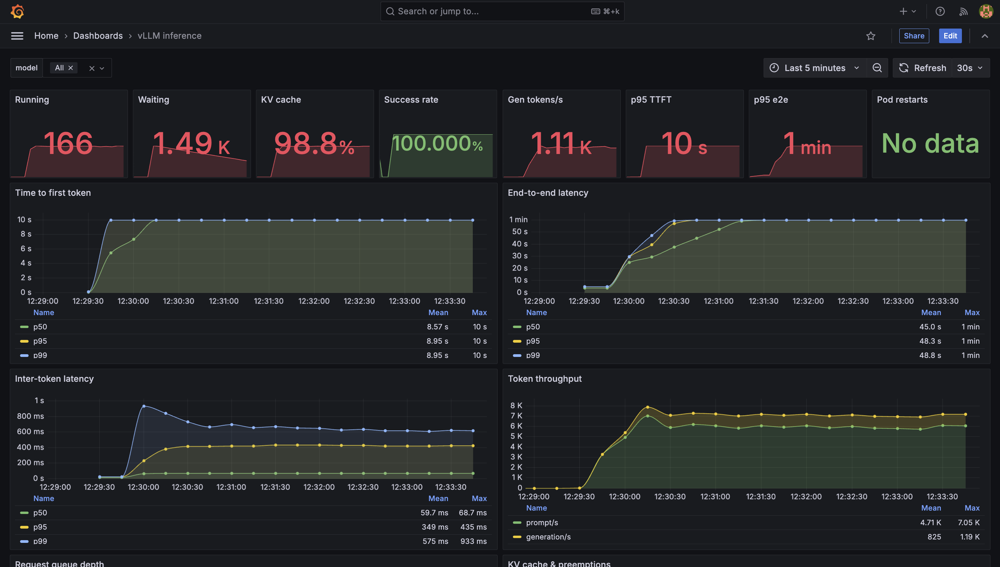

# 02 — Reliability model

> **This is the story doc.** The rest of `docs/` describes *what* each component
> does. This doc explains *why the whole platform is built this way* — the
> failure modes it defends against, and how every layer contributes to keeping
> a single GPU serving traffic without falling over.

## What "inference reliability" actually means

For a traditional web service, "reliable" usually reduces to:

- Availability (is it responding?)
- Latency (is the response fast?)
- Error rate (is the response correct?)

LLM inference adds four more that traditional stacks don't have — and they are
where most self-hosted inference platforms drift into unreliability:

1. **KV-cache saturation.** Every in-flight request holds GPU memory
   proportional to its context length. When the cache fills, vLLM **preempts**
   partially-generated requests — they either restart or fail. A "healthy"
   inference server can silently be killing user sessions.
2. **Queue depth vs. batch fill.** vLLM batches decode steps across concurrent
   requests. Underfilled batches waste GPU; overfilled batches queue new
   requests and blow p95 TTFT. There's a right band, and it's model-specific.
3. **Long-tail latency from context length.** Request duration scales roughly
   linearly with output tokens and quadratically with input tokens (attention
   cost). A single 32k-token prompt can starve a whole batch.
4. **Model quality regression.** A "successful" HTTP 200 with garbage output
   is worse than an error. Model quality has to be measured continuously,
   because it degrades from prompt template changes, model version bumps, dtype
   changes, and even library upgrades.

Below is how each layer of this repo addresses these.

## The layers, from the outside in

### 1. Coarse traffic shaping — Envoy Gateway rate limit

`httproutes/vllm-ratelimit.yaml` — `BackendTrafficPolicy` capping the vLLM
route at **60 req/min**. It exists to protect the platform from a stampede
that would blow past any smart routing further down.

Rate limiting an LLM by requests-per-minute is coarse (a 32k-token request is
100× the work of a 200-token one). The point isn't precision — it's a floor
under how bad things can get during an incident. Fine-grained shaping
(concurrent-request cap, token-per-minute cap) belongs in the endpoint picker
policy or in the vLLM `--max-num-seqs` / `--max-num-batched-tokens` flags.

### 2. KV-cache-aware routing — Gateway API Inference Extension (EPP)

This is the piece most self-hosted vLLM installs skip. `inference/*.yaml`
deploys the Gateway API **Endpoint Picker** (EPP) — a gRPC ext_proc filter
that Envoy calls before it routes each request.

EPP scrapes `vllm:num_requests_waiting`, `vllm:num_requests_running`, and
`vllm:gpu_cache_usage_perc` on every pod once per second. It uses these to
pick a pod that can *actually* serve the request without preempting active
users.

On a single-GPU install (this repo), EPP has one pod to pick from — it's
still useful because it will:

- Return a fast `503` when KV cache is saturated (instead of queuing forever)
- Add `x-gateway-destination-endpoint` and `x-gateway-request-count` headers
  for observability

On multi-pod / multi-GPU installs, it's the difference between "roughly
round-robin" and "actual load balancing".

Details: [`07-inference-extension-epp.md`](07-inference-extension-epp.md).

### 3. vLLM configuration — the workhorse

`charts/llama-8b/values.yaml` sets:

- `--api-key` — auth barrier so the OpenAI endpoint isn't publicly writable
- OTLP tracing — every request gets a Tempo trace, linked from Loki logs
- `startupProbe` with a **30-minute** failure window — HF model download is
  slow on first launch; the pod is not "unhealthy" during download
- `readinessProbe` on `/health` — pod stops receiving traffic before it
  crashes, so Envoy Gateway 5xx rate stays low during rollouts
- `preStop: sleep 15s` + `terminationGracePeriodSeconds: 120` — graceful
  drain so in-flight requests finish before SIGTERM

The vLLM container gets:

- **`priorityClassName: gpu-inference` (value 1M)** — this is the pod the
  scheduler must never evict for a load test or an eval pod
- **`/dev/shm: 2Gi`** — PyTorch multiprocessing uses shared memory; the
  default 64MB `/dev/shm` from containerd causes "Bus error" crashes during
  prefill. Kyverno enforces this on all GPU pods.
- **`runtimeClassName: nvidia`** — required by the NVIDIA container toolkit
  to inject `libnvidia-*` and set up device access. Kyverno mutates pods that
  omit it.
- **`resources.requests` for CPU and memory** — makes the pod QoS
  `Guaranteed` (via `require-inference-pod-resources` policy) so it can't be
  evicted by memory pressure from other workloads.

Details: [`06-inference-vllm.md`](06-inference-vllm.md).

### 4. Autoscaling — KEDA on queue depth, not CPU

`charts/llama-8b/templates/scaledobject.yaml` (KEDA) reads
`sum(vllm:num_requests_running + vllm:num_requests_waiting)` from Prometheus.
An HPA on CPU or memory tells you nothing useful about an LLM — the GPU is
the bottleneck. Queue depth tells you if you need another pod.

On this single-GPU install `maxReplicas=1` so KEDA is inert; it exists as a
template you flip on when you add a second node. See
[`09-keda-autoscaling.md`](09-keda-autoscaling.md).

### 5. Admission-time guardrails — Kyverno

Kyverno policies (`policies/`) sit between `kubectl apply` and the API
server. They stop unreliable pods from being created at all:

- **`require-gpu-pod-shm`** — every GPU pod must mount `/dev/shm` with
  ≥1Gi. Prevents PyTorch "Bus error" crashes.
- **`mutate-nvidia-runtime-class`** — every GPU pod gets `runtimeClassName:
  nvidia`. Prevents "unknown device: nvidia.com/gpu" scheduling errors.
- **`require-inference-pod-priorityclass`** — inference pods must set a
  `priorityClassName`. Prevents the vLLM pod from being evicted by a load
  test.
- **`require-inference-pod-resources`** — inference pods must have
  `requests.cpu` and `requests.memory`. Prevents `BestEffort` QoS eviction.
- **`validate-argo-pod-limits`** — load test pods must have CPU + memory
  limits. Prevents an eval script from OOMing the node.
- **`verify-vllm-image`** — vLLM images should have a Cosign signature (Audit
  mode today).

Details: [`11-kyverno-policies.md`](11-kyverno-policies.md).

### 6. Observability — see problems before they page

Reliability isn't just about the request path; it's about knowing what's
happening.

Every layer emits telemetry:

- **vLLM `:8000/metrics`** — every scheduler counter, every KV-cache stat,
  every token-per-second gauge
- **DCGM `:9400/metrics`** — GPU utilization, temperature, power, ECC, XID
  errors, throttling reasons
- **Envoy proxy `/stats/prometheus`** — per-route, per-listener HTTP status,
  active connections, upstream latency
- **EPP `:9090/metrics`** — endpoint-picker decisions
- **OTel Collector** — vLLM OTLP traces to Tempo, pod logs to Loki

The dashboards ([`13-dashboards.md`](13-dashboards.md)) turn this into six
views:

| Dashboard | Answers |
|-----------|---------|
| `vllm.yaml` | Is the inference server healthy right now? |
| `gpu.yaml` | Is the GPU hardware healthy? Thermally throttling? ECC errors? |
| `gateway.yaml` | Are clients getting 5xx? Where in the request path? |
| `inference-cost.yaml` | What's this workload costing us in tokens and GPU-hours? |
| `loadtests.yaml` | Did last night's benchmark suite regress? |
| `model-quality.yaml` | Is the model still giving correct answers? |

And alerts ([`14-alerts.md`](14-alerts.md)) turn *those* into pages:

- **`VLLMHighTTFT`** / **`VLLMHighQueueDepth`** — latency SLO burning
- **`VLLMKVCacheAlmostFull`** / **`VLLMHighPreemptionRate`** — sacrifice
  starting to happen
- **`VLLMErrorBudgetBurnFast`** / **`VLLMErrorBudgetBurnSlow`** — multi-window
  burn-rate alerts (Google SRE workbook style)
- **`GPUXIDError`** / **`GPUECCDoubleBitError`** — hardware fault; quarantine
- **`ModelQualityLowOverallPassRate`** / **`ModelQualityCategoryRegressed`**
  — quality regression from an eval run

### 7. Continuous quality verification — evals

Every 6 hours, `evals/cronworkflow.yaml` runs 12 prompts through vLLM
(factual, math, code, instruction, reasoning), scores them with regexes,
and pushes `model_eval_pass_rate` and `model_eval_latency_seconds` to
Pushgateway. Alerts fire on regression.

This catches:

- Silent model swap (someone edited `values.yaml`)
- Prompt template change (chat template got mangled)
- Dtype flip (bfloat16 → fp8 quantization dropped accuracy)
- Library upgrade regression (vLLM 0.9 changed tokenizer behavior)

Details: [`16-evals.md`](16-evals.md).

### 8. Rollout safety — the PostSync gate

`charts/llama-8b/templates/rollout-gate-job.yaml` is an ArgoCD **PostSync**
hook that runs `vllm bench serve` against the freshly-rolled-out pod. It
enforces:

- **p95 TTFT ≤ 3s** (`rolloutGate.maxP95TtftSeconds`)
- **Error rate ≤ 2%** (`rolloutGate.maxErrorRate`)
- 30 prompts at 2 req/s

If either threshold breaks, the sync fails — you get a red Application in
ArgoCD instead of silent user-facing degradation.

### 9. Load testing — proving capacity

Nightly at 02:23 UTC, `loadtests/argo/suite-cronworkflow.yaml` runs a
4-scenario DAG:

1. **warmup** — 20 prompts at 2 req/s, small context
2. **baseline** — 200 prompts at 5 req/s, medium context
3. **burst** — 500 prompts at ∞ req/s, medium context (stress test)
4. **long-context** — 50 prompts at 2 req/s, 4k input tokens (starvation test)

Results push to Pushgateway → Grafana → alerts. See
[`15-loadtests.md`](15-loadtests.md).

### 10. Secrets rotation — ESO + Vault

`ExternalSecret` resources refresh every hour from Vault. Rotate the HF
token or vLLM API key in Vault; ESO syncs it; the vLLM pod picks it up on
the next restart. No `kubectl edit secret`, no leaked credentials in Git.

Details: [`10-secrets-eso-vault.md`](10-secrets-eso-vault.md).

### 11. GitOps — every change is reversible

Every manifest is an ArgoCD `Application` with `automated.prune=true` and
`selfHeal=true`. If someone `kubectl edit`s the vLLM Deployment on the
cluster, ArgoCD reverts within ~3 minutes. Rollback is `git revert` + push.

Details: [`03-bootstrap-and-gitops.md`](03-bootstrap-and-gitops.md).

## The reliability contract — SLOs

The `alerts/vllm-slo.yaml` and `alerts/model-quality.yaml` files codify these
SLOs:

| SLO | Target | Alert |
|-----|--------|-------|
| **Availability** | 99.9% (HTTP 2xx on `/v1/*`) | `VLLMErrorBudgetBurnFast/Slow` (multi-window burn-rate) |
| **TTFT p95** | ≤ 2s | `VLLMHighTTFT` |
| **E2E latency p95** | ≤ 10s | `VLLMHighE2ELatency` |
| **Queue depth** | ≤ 20 requests | `VLLMHighQueueDepth` |
| **KV cache pressure** | ≤ 95% | `VLLMKVCacheAlmostFull` |
| **Preemption rate** | ≤ 0.1 / 5m | `VLLMHighPreemptionRate` |
| **Model quality** | ≥ 70% pass on eval set | `ModelQualityLowOverallPassRate` |

**Multi-window burn-rate alerts** (Google SRE Workbook, chapter 6): fast
alert fires when error budget would exhaust in hours; slow alert fires when
budget would exhaust in a day. Prevents both blind spots (slow-only misses
outages) and alert fatigue (fast-only pages for every 30-second blip).

## What this repo *doesn't* solve

Being honest — reliability is broader than any one repo:

- **Multi-region failover** — single node, single GPU. Adding a second
  region means dual-write of secrets, cross-region Vault, latency-aware
  DNS. Out of scope.
- **Model warm pools** — cold start is ~30 minutes (HF download + weight
  load). Serious production needs pre-warmed replicas per model variant.
  This repo has one replica.
- **Multi-tenancy / per-tenant quotas** — the ratelimit is global.
  Per-tenant needs API keys with tenant labels, ratelimit keyed on the
  tenant.
- **Adversarial safety** — no input classifier, no output moderation, no
  jailbreak detection. Downstream problem.
- **Cost attribution** — dashboard shows aggregate cost; per-tenant needs
  request-level accounting.

See [`20-making-inference-reliable.md`](20-making-inference-reliable.md) for
the wider design space.

## Next

- If you want the concrete details, jump to any of the component docs.
- If you're building your own version of this, read
  [`20-making-inference-reliable.md`](20-making-inference-reliable.md) first
  — it's the design essay this doc summarizes.
