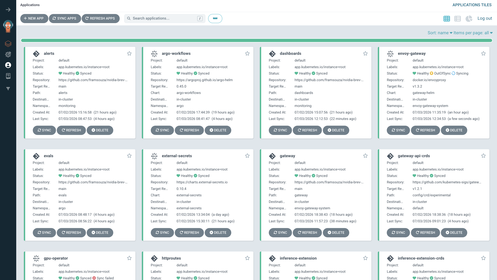

# 03 — Bootstrap & GitOps (ArgoCD)

Everything on the cluster is deployed by ArgoCD. This doc covers how the
bootstrap works, how sync waves order things, and how to add or change apps.

## Files

```
bootstrap/
├── install.sh              One-shot cluster bootstrap
├── seed-vault.sh           Populate Vault with dev credentials
├── namespace.yaml          argocd namespace
└── root-app.yaml           Root Application → apps/
apps/                       24 ArgoCD Applications (app-of-apps children)
```

## The bootstrap flow

Running `bash bootstrap/install.sh` on a fresh cluster does the following:

1. **Requires two env vars**:
   - `GITHUB_TOKEN` — PAT for repo access (public repos still need it if
     private modules are referenced).
   - `HF_TOKEN` — Hugging Face token to download `meta-llama/Meta-Llama-3-8B-Instruct`.
   - Optionally `VLLM_API_KEY` (generated if missing) and `REPO_URL`.

2. **Applies `bootstrap/namespace.yaml`** — creates `argocd`.

3. **Installs ArgoCD** from the upstream manifest for `ARGOCD_VERSION`
   (default v2.13.1). Uses `kubectl apply -n argocd -f https://raw.githubusercontent.com/argoproj/argo-cd/${VERSION}/manifests/install.yaml`.

4. **Patches `argocd-cmd-params-cm`** to run under the `/argocd` sub-path (so
   Envoy Gateway can serve it) and enable server-side diff.

5. **Applies the ArgoCD repository secret** using the GitHub token so ArgoCD
   can pull from GitHub.

6. **Applies `bootstrap/root-app.yaml`** — the top-level ArgoCD Application
   that points at `apps/`. From this point ArgoCD takes over: it applies
   every `apps/*.yaml`, which in turn create the actual workloads.

7. **Waits for the `vault` StatefulSet** — the Vault Application syncs early
   because ESO needs it.

8. **Waits for the ExternalSecret CRDs** — installed by the ESO chart.

9. **Runs `seed-vault.sh`**:
   - Reads existing `secret/vllm/apiKey` from Vault; if present, reuses it
     (avoids restarting the vLLM pod on re-seed). Otherwise generates a
     32-char base64 key.
   - `vault kv put secret/hf token=$HF_TOKEN`
   - `vault kv put secret/github url=$REPO_URL username=$GITHUB_USER password=$GITHUB_TOKEN`
   - `vault kv put secret/vllm apiKey=$VLLM_API_KEY`
   - Annotates each `ExternalSecret` with `force-sync=$now` so ESO pulls
     immediately instead of waiting for the 1h refresh.
   - `kubectl rollout restart deploy/llama-llama-8b -n llama` so the pod
     picks up the freshly-synced API key.

10. **Exits.** ArgoCD continues to sync every wave in the background.

Once every wave has landed, the ArgoCD **Applications** view shows every
child Application `Healthy` + `Synced`:



Total time on a warm cluster: ~10 minutes. The long pole is:

- vLLM image pull (~2 GB)
- HF Llama-3-8B download (~16 GB) on first launch
- KEDA metric propagation

## The root app

`bootstrap/root-app.yaml`:

- `spec.source.repoURL: https://github.com/framsouza/inference-reliability-platform.git`
- `spec.source.path: apps`
- `spec.destination.namespace: argocd`
- `syncPolicy.automated.prune: true` / `selfHeal: true`
- No `sync-wave` annotation → wave 0, applied first.

Everything else flows from ArgoCD noticing files in `apps/` and creating
child Applications.

## Sync waves — the dependency graph

Every child Application in `apps/*.yaml` carries the annotation
`argocd.argoproj.io/sync-wave: "<N>"`. ArgoCD applies lower numbers first.

| Wave | Apps | Purpose | Depends on |
|------|------|---------|-----------|
| **-6** | `gateway-api-crds` | Install Gateway API v1.2.1 experimental CRDs (`InferencePool` needs experimental TCPRoute) | Nothing |
| **-4** | `envoy-gateway` | Envoy Gateway Helm chart v1.3.2 | CRDs from wave -6 |
| **-3** | `inference-extension-crds` | Gateway API Inference Extension CRDs v1.5.0 (`InferencePool`, `InferenceModel`) | Nothing (but must precede `inference-extension`) |
| **-2** | `gateway` | `GatewayClass eg`, `Gateway public`, `EnvoyProxy` telemetry config, PodMonitor | Envoy Gateway from -4 |
| **0** | `gpu-operator`, `kube-prometheus-stack`, `vault`, `loki`, `tempo` | Foundational: GPUs, metrics, secrets backend, logs, traces | Nothing (parallel) |
| **3** | `keda`, `kyverno` | Scaling and admission control | Nothing directly |
| **5** | `otel-collector`, `argo-workflows`, `pushgateway`, `external-secrets`, `alerts`, `dashboards` | Observability + secrets + CI/CD scaffolding | kube-prometheus-stack (for ServiceMonitor CRD) |
| **7** | `policies` | Kyverno ClusterPolicies | Kyverno from wave 3 |
| **10** | `llama` | The vLLM Helm release | Wave 5 (ESO for secrets), wave 7 (policies enforce vLLM shape) |
| **11** | `httproutes`, `inference-extension` | Gateway routing + EPP | vLLM pod exists (wave 10) so `InferencePool` selector resolves |
| **12** | `evals` | Model quality `CronWorkflow` | vLLM reachable |
| **20** | `loadtests` | Nightly benchmark `CronWorkflow` | Everything above |

**Rule of thumb**: if adding a new app, ask "what CRDs and services must
exist for my manifests to apply and my pods to run?" and pick the smallest
wave greater than the highest dependency.

## App source patterns

Two patterns are used in `apps/*.yaml`:

**1. Upstream Helm chart** — for third-party components:

```yaml
source:
  repoURL: https://prometheus-community.github.io/helm-charts
  chart: kube-prometheus-stack
  targetRevision: 66.3.1
  helm:
    values: |
      prometheus:
        prometheusSpec:
          retention: 6h
          ...
```

**2. Local path** — for this repo's own manifests:

```yaml
source:
  repoURL: https://github.com/framsouza/inference-reliability-platform.git
  path: httproutes
  targetRevision: HEAD
```

The `llama` Application uses the third pattern (local Helm chart):

```yaml
source:
  repoURL: https://github.com/framsouza/inference-reliability-platform.git
  path: charts/llama-8b
  targetRevision: HEAD
  helm:
    releaseName: llama
    values: |
      ...
```

## Sync options used

Every child Application enables:

- `syncOptions: CreateNamespace=true` — bootstrap the target namespace
- `syncOptions: ServerSideApply=true` — needed for Envoy Gateway CRDs and
  Prometheus Operator CRDs (they exceed the 262144-char annotation limit
  of client-side apply)
- `automated.prune: true` — deleting a manifest from git deletes the
  resource from the cluster
- `automated.selfHeal: true` — drift from kubectl edits is reverted

For the Gateway API CRDs Application:

- `syncOptions: Replace=true` — CRDs use `metadata.generation` fields ArgoCD
  otherwise refuses to touch.

## The bootstrap script — reading `install.sh` line by line

Key parts of `bootstrap/install.sh` worth knowing:

- **`set -euo pipefail`** — any failure aborts the script.
- **`kubectl wait --for=condition=established --timeout=180s crd/<name>`** —
  ArgoCD Application CRD must exist before applying the root app.
- **`kubectl -n argocd patch cm argocd-cmd-params-cm --type merge -p '{"data":{"server.rootpath":"/argocd","server.basehref":"/argocd","server.insecure":"true"}}'`**
  — makes ArgoCD serve at `/argocd` rather than `/`, matching the HTTPRoute
  in `httproutes/argocd.yaml`. `server.insecure=true` because TLS is
  terminated at Envoy Gateway.
- **`kubectl -n argocd rollout restart deploy/argocd-server`** — required
  for the config change to take effect.

## The seed script — reading `seed-vault.sh`

- Uses `vault kv get -field=apiKey secret/vllm 2>/dev/null || …` to reuse
  existing keys. This is important: naively regenerating the key would
  break clients.
- Uses `kubectl -n <ns> annotate --overwrite externalsecret <name>
  force-sync=$(date +%s)` to force ESO to pull immediately. Without this,
  ESO would refresh on its 1h interval.
- Restarts the vLLM Deployment at the end so envvar bindings pick up the
  fresh Secret. (Kubernetes doesn't auto-restart pods when their Secrets
  change.)

## Adding a new ArgoCD Application

1. Decide the sync wave (see table above).
2. Create `apps/<name>.yaml`:

   ```yaml
   apiVersion: argoproj.io/v1alpha1
   kind: Application
   metadata:
     name: my-thing
     namespace: argocd
     annotations:
       argocd.argoproj.io/sync-wave: "5"
   spec:
     project: default
     source:
       repoURL: https://github.com/framsouza/inference-reliability-platform.git
       path: my-thing
       targetRevision: HEAD
     destination:
       server: https://kubernetes.default.svc
       namespace: my-thing
     syncPolicy:
       automated:
         prune: true
         selfHeal: true
       syncOptions:
         - CreateNamespace=true
         - ServerSideApply=true
   ```

3. Commit and push. ArgoCD picks it up within 3 minutes (default poll).
4. Check `kubectl -n argocd get app my-thing -o yaml` for sync status.

## Rolling back

- **Trivial change**: `git revert` and push. ArgoCD reconciles.
- **Bad CRD upgrade**: temporarily set the Application to `syncPolicy: {}`
  (disable auto-sync), revert manually, then re-enable.
- **Full-cluster rollback**: `git checkout <good-commit>`, force-push (with
  approval), ArgoCD reconciles everything.

## Debugging sync failures

- `argocd app get <name>` — shows sync status, health, last error.
- `argocd app diff <name>` — shows what ArgoCD *would* apply vs. what's
  live. Useful for detecting Kyverno rejections (the diff will show a
  policy error).
- `kubectl -n argocd logs deploy/argocd-application-controller | grep <app-name>`
  — controller logs for the sync attempt.
- `kubectl get events -n <target-ns>` — resource-level failures.

## Extending / operating

- **Change an app version**: edit `apps/<name>.yaml`, bump
  `targetRevision:`, commit, push.
- **Pin the repo to a tag**: change `targetRevision: HEAD` → `v1.2.3` on the
  root app to make everything track a release.
- **Multi-cluster**: replicate `bootstrap/root-app.yaml` per cluster,
  pointing each at a different `apps/<env>/` folder in the repo.
- **Break-glass**: disable `automated.selfHeal` in `bootstrap/root-app.yaml`
  to allow manual `kubectl edit` during an incident.

## Related docs

- Apps configuration by component:
  - Gateway: [`08-gateway-envoy.md`](08-gateway-envoy.md)
  - Inference: [`06-inference-vllm.md`](06-inference-vllm.md)
  - Observability: [`12-observability.md`](12-observability.md)
- CI validation of Application manifests: [`17-ci-cd.md`](17-ci-cd.md)
