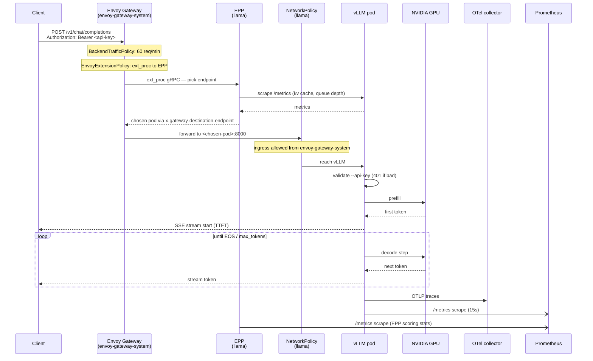

# 07 — Gateway API Inference Extension (EPP)

The **Endpoint Picker** (EPP) is what makes vLLM routing *smart*. It's a
gRPC ext_proc filter that Envoy Gateway calls before routing each request,
so the request lands on the pod that can actually serve it — not the pod
whose IP came up next in round-robin.

This is upstream Kubernetes work:
[kubernetes-sigs/gateway-api-inference-extension](https://github.com/kubernetes-sigs/gateway-api-inference-extension).
This repo is on **v1.5.0**.

## Files

```
inference/
├── inferencepool.yaml           InferencePool CR
├── epp-deployment.yaml          EPP Deployment + Service + ServiceMonitor
├── epp-rbac.yaml                ServiceAccount + ClusterRole + Binding
└── epp-networkpolicy.yaml       NetworkPolicy for EPP ↔ vLLM ↔ Envoy
apps/inference-extension-crds.yaml    CRD install Application (wave -3)
apps/inference-extension.yaml         Runtime install Application (wave 11)
httproutes/vllm-epp-extension.yaml    EnvoyExtensionPolicy wiring EPP → Gateway
```

## The `InferencePool` CR

```yaml
apiVersion: inference.networking.k8s.io/v1
kind: InferencePool
metadata:
  name: llama-8b
  namespace: llama
spec:
  selector:
    app.kubernetes.io/name: llama-8b
    app.kubernetes.io/instance: llama
  targetPortNumber: 8000
  endpointPickerRef:
    name: llama-8b-epp
    port: 9002
```

The `selector` matches the vLLM pod's labels. `targetPortNumber` is vLLM's
port. `endpointPickerRef` tells the pool which EPP to consult.

An `InferencePool` is *not* a routing rule — it's a **pool description**.
The routing rule lives in `EnvoyExtensionPolicy` (see below).

## The EPP Deployment

`inference/epp-deployment.yaml` runs
`registry.k8s.io/gateway-api-inference-extension/epp:v1.5.0`. Key args:

```
--pool-name=llama-8b
--pool-namespace=llama
--grpc-port=9002                        # ext_proc listener
--grpc-health-port=9003
--metrics-port=9090
--kv-cache-usage-percentage-metric=vllm:gpu_cache_usage_perc
```

The last argument is important: EPP is model-server-agnostic, but each
server publishes KV-cache metrics under different names. For vLLM v0.7.3,
the field is `vllm:gpu_cache_usage_perc`. (For TGI, TensorRT-LLM, etc.,
you'd change it.)

Probes are gRPC health checks on port 9003. Resources: 200m/256Mi req,
512Mi limit. EPP is lightweight — it doesn't do inference, just decides.

## `ServiceMonitor`

Scrapes `llama-8b-epp:9090/metrics` every 15s. Metrics include:

- `endpoint_picker_requests_total{result="hit|miss|error"}`
- `endpoint_picker_decision_duration_seconds` (histogram)
- `endpoint_picker_pool_size`
- Per-pod scrape success from EPP's own inner Prometheus client

## RBAC (why it's this broad)

`inference/epp-rbac.yaml` grants a `ClusterRole`:

```yaml
- apiGroups: [""]
  resources: [pods, services, endpointslices]
  verbs: [get, list, watch]
- apiGroups: [inference.networking.k8s.io]
  resources: [inferencepools, inferenceobjectives, inferencemodels,
              inferencemodelrewrites, inferencepoolimports]
  verbs: [get, list, watch]
- apiGroups: [gateway.networking.k8s.io]
  resources: [httproutes]
  verbs: [get, list, watch]
- apiGroups: [authentication.k8s.io]
  resources: [tokenreviews]
  verbs: [create]
- apiGroups: [authorization.k8s.io]
  resources: [subjectaccessreviews]
  verbs: [create]
```

Why so broad:

- **Pods/services/endpointslices** — EPP polls the pool selector to
  discover live vLLM pod IPs.
- **`inference*` CRDs** — future extension points (per-model routing
  rewrites, cross-cluster pool import).
- **HTTPRoute** — correlates the ext_proc call to its owning route.
- **`tokenreviews`/`subjectaccessreviews`** — EPP validates Envoy's SPIFFE
  identity when authentication is enabled.

## NetworkPolicy — EPP's blast radius

`inference/epp-networkpolicy.yaml` defines two policies:

1. **EPP ingress** (matches EPP pod):
   - From `envoy-gateway-system` on 9002 (ext_proc gRPC) and 9003 (health).
   - From `monitoring` on 9090 (metrics).
2. **EPP egress**:
   - Kube-system DNS (53 UDP/TCP).
   - Kubernetes API server (443, 6443) — for pod watches.
   - vLLM pods on 8000 — for scraping `/metrics`.
3. **vLLM ingress from EPP** (`allow-epp-scrape`, in `llama` ns):
   - Allows the EPP pod to reach vLLM on 8000 for metric scraping (this
     is in addition to the Envoy Gateway ingress allow rule).

## Inference request path

What happens on a single `POST /v1/chat/completions` — Envoy Gateway
rate limit, `EnvoyExtensionPolicy` calling EPP for endpoint selection,
NetworkPolicy filter, API-key check, GPU prefill / decode, side-effect
metrics. Source:
[`../images/inference-request-path.mmd`](../images/inference-request-path.mmd).



Read this diagram in tandem with the wiring described below — `ext_proc`
is what makes step 3 (Envoy → EPP) happen, and the
`EnvoyExtensionPolicy` in the next section is where that wiring lives.

## How EPP plugs into Envoy Gateway

`httproutes/vllm-epp-extension.yaml`:

```yaml
apiVersion: gateway.envoyproxy.io/v1alpha1
kind: EnvoyExtensionPolicy
metadata:
  name: vllm-epp
  namespace: llama
spec:
  targetRefs:
    - group: gateway.networking.k8s.io
      kind: HTTPRoute
      name: vllm
  extProc:
    - backendRefs:
        - group: ""
          kind: Service
          name: llama-8b-epp
          port: 9002
      processingMode:
        request:
          body: Buffered
        response:
          body: Streamed
```

- `targetRefs` — apply this policy to the `HTTPRoute` named `vllm`.
- `extProc.backendRefs` — call the `llama-8b-epp` service on 9002.
- `processingMode.request.body: Buffered` — Envoy sends the full request
  body to EPP so it can inspect the model name (`{"model": "...", ...}`).
- `processingMode.response.body: Streamed` — response is not buffered;
  EPP only sees the trailers.

At runtime this creates an Envoy `ext_proc` filter on the route. Envoy
calls EPP over gRPC for every request; EPP inspects the body, picks a
pod, and returns `x-gateway-destination-endpoint: <pod-IP>:8000`. Envoy
routes to that IP.

## Why this matters (recap from `02-reliability.md`)

LLM inference is stateful:

- Each active request pins some KV-cache pages.
- vLLM preempts the least-recently-scheduled request when cache fills.
- Preemption = user-visible latency spike or aborted stream.

Round-robin routing is oblivious to this. It can send request N to a pod
whose cache is 99% full, causing eviction of request N-3 that a user is
still streaming.

EPP fixes this by looking at each candidate pod's metrics and picking the
one with the most headroom. On a single-pod install (this repo) the
"decision" is trivial — but the presence of EPP means:

- You can add pods and get correct load balancing for free.
- You get a rich observability layer (endpoint-picker metrics, per-decision
  traces).
- You can extend selection with custom criteria (e.g. per-tenant routing,
  affinity by model version).

## Debugging

- **EPP not being called** — check the `EnvoyExtensionPolicy` has
  `targetRefs` matching the right HTTPRoute name and namespace. `kubectl
  describe eep` shows status.
- **All requests 500** — EPP crash-looping? `kubectl -n llama logs
  deploy/llama-8b-epp` shows the reason. Common: bad
  `--kv-cache-usage-percentage-metric` value → EPP fails to parse metrics.
- **EPP always picks the same pod even with N replicas** — check that vLLM
  pods have the exact labels in the `InferencePool.spec.selector`. Missing
  labels → pool is empty → EPP returns whichever pod endpoints controller
  gives it.
- **High EPP decision latency** — EPP scrapes vLLM `/metrics` in-band on
  cache miss. Warm-cache p99 should be <5ms; if not, EPP might be blocked
  on network policies. Check `endpoint_picker_decision_duration_seconds`.

## Extending / operating

- **Multiple models** — one `InferencePool` per model, one
  `EnvoyExtensionPolicy` per HTTPRoute. EPP inspects the `"model"` field
  in the request body and routes accordingly.
- **Per-tenant routing** — pre-process the request header in an Envoy
  filter to set a tenant tag, then use an `InferenceModelRewrite` CR to
  translate to a pool.
- **Cross-cluster** — `InferencePoolImport` lets EPP see pools in remote
  clusters (via Gateway API Multi-cluster). Requires a shared identity
  provider.
- **Newer EPP version** — bump the image in `inference/epp-deployment.yaml`;
  double-check the RBAC verbs required (they've expanded over releases).

## Related docs

- Request path diagram: [`../images/inference-request-path.mmd`](../images/inference-request-path.mmd)
- Envoy Gateway routing: [`08-gateway-envoy.md`](08-gateway-envoy.md)
- vLLM chart: [`06-inference-vllm.md`](06-inference-vllm.md)
- KV-cache alerts: [`14-alerts.md`](14-alerts.md)
