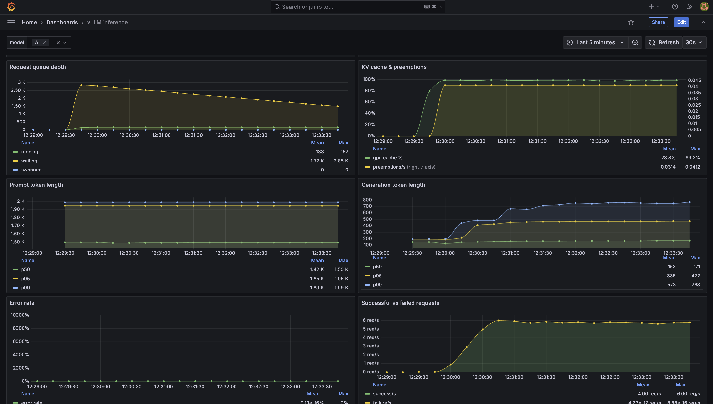
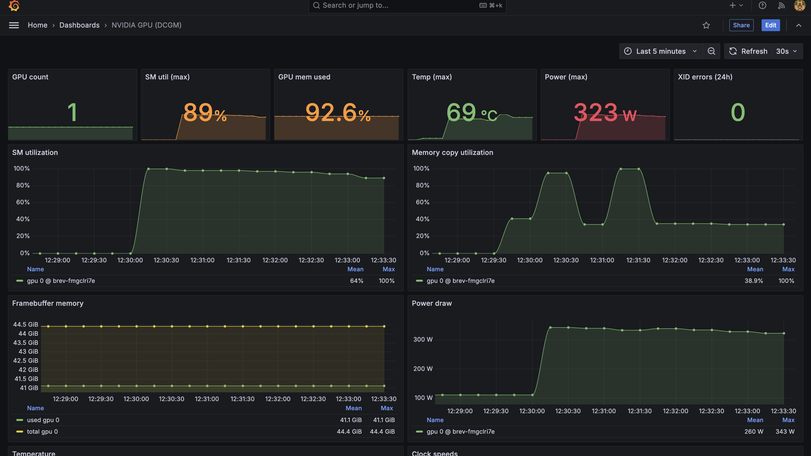
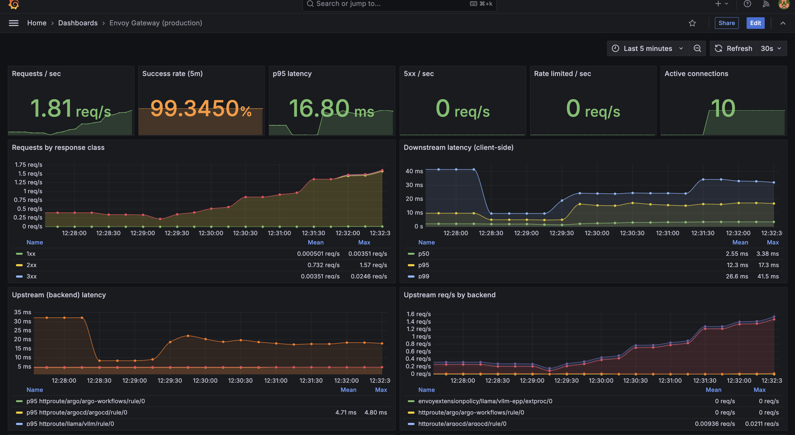
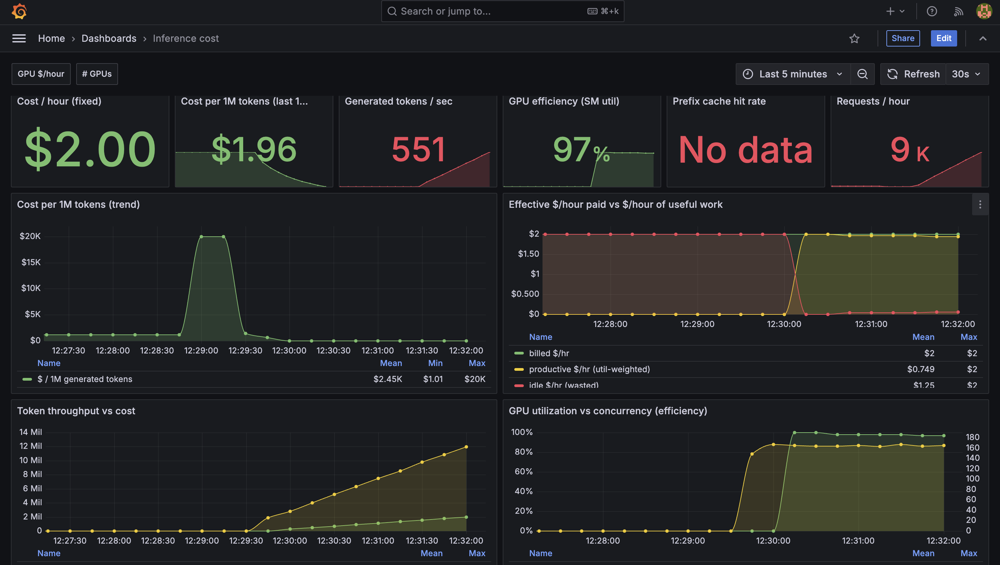
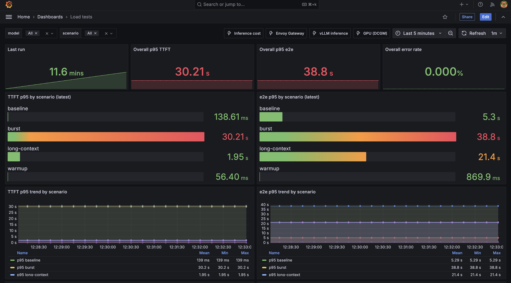
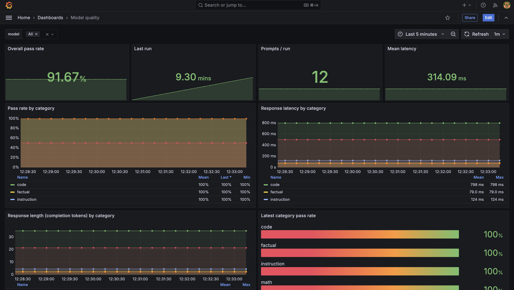

# 13 — Dashboards

Six Grafana dashboards ship in this repo. Each is a ConfigMap in the
`monitoring` namespace labeled `grafana_dashboard: "1"`, which the
Grafana sidecar auto-imports.

## Files

```
dashboards/
├── vllm.yaml               vLLM inference health
├── gpu.yaml                GPU hardware health (DCGM)
├── gateway.yaml            Envoy Gateway traffic
├── inference-cost.yaml     Cost & throughput per request
├── loadtests.yaml          Nightly benchmark history
└── model-quality.yaml      Continuous eval results
apps/dashboards.yaml        ArgoCD Application → dashboards/ (wave 5)
```

## `vllm.yaml` — Inference server health

**Use it when**: latency is climbing, users are timing out, or you want a
real-time view of the model.

**Top row** — the "at-a-glance" stat row: running, waiting, KV cache %,
success rate, generated tok/s, p95 TTFT, p95 E2E, pod restarts. Below
that, TTFT / E2E histograms and inter-token latency:


**Second half** — queue depth, KV cache pressure, prompt/generation
length distributions, error rate, success/fail rates:



Panels (top to bottom):

- **Running vs. waiting** — gauge of
  `vllm:num_requests_running` and `vllm:num_requests_waiting`. The
  ratio tells you whether the pod is at a healthy batch fill or queuing.
- **KV cache usage** — `vllm:gpu_cache_usage_perc`. Above 95% you're
  about to preempt.
- **TTFT histogram** — `histogram_quantile(0.95,
  rate(vllm:time_to_first_token_seconds_bucket[5m]))` at p50, p95, p99.
- **E2E latency** — same but for `vllm:e2e_request_latency_seconds`.
- **Throughput (tokens/sec)** — `rate(vllm:generation_tokens_total[1m])`.
- **Preemption counter** — `rate(vllm:num_preemptions_total[5m])`. Any
  non-zero value is a sacrifice you should investigate.
- **Abort counter** — `rate(vllm:request_abort_total[5m])`. Clients giving
  up.
- **GPU utilization** — cross-referenced from DCGM.

Time range template variable: `$__range`. Model template variable: `$model`
(supports multi-model in the future).

## `gpu.yaml` — GPU hardware health (DCGM)

**Use it when**: `GPUXIDError`, `GPUECCDoubleBitError`, or thermal alerts
fire.



Panels:

- **GPU count** — how many `nvidia.com/gpu` present.
- **SM utilization** — `DCGM_FI_DEV_GPU_UTIL`; max across cards.
- **Power draw** — `DCGM_FI_DEV_POWER_USAGE` (W).
- **Temperature** — `DCGM_FI_DEV_GPU_TEMP` (°C). Correlate with
  throttling events below.
- **Frame buffer memory** — `DCGM_FI_DEV_FB_USED` / `DCGM_FI_DEV_FB_FREE`.
  Full FB = KV cache exhaustion.
- **Clocks** — SM clock, memory clock. Dips indicate throttling.
- **Throttling events** — `DCGM_FI_DEV_THERMAL_VIOLATION`,
  `DCGM_FI_DEV_POWER_VIOLATION`, `DCGM_FI_DEV_SYNC_BOOST_VIOLATION`.
- **ECC errors** — single-bit corrected (fine, monitor) and double-bit
  uncorrectable (RMA).
- **XID errors** — any non-zero is a hardware issue.

## `gateway.yaml` — Envoy proxy traffic

**Use it when**: users report 5xx or connection issues, or you're
debugging a routing change.



Panels:

- **Requests per second by route** — `rate(envoy_cluster_upstream_rq_total)`.
- **Success rate (5m)** — `sum(rate(envoy_cluster_upstream_rq_completed
  {response_code_class=~"2xx"}[5m])) / sum(rate(...))`.
- **Latency p50/p95/p99** — Envoy's per-route response histogram.
- **Per-route error rate** — 4xx and 5xx split by
  `envoy_cluster_name`.
- **Connection pool saturation** —
  `envoy_cluster_upstream_cx_active` vs.
  `envoy_cluster_upstream_cx_max_requests`.
- **Rate limit hits** — `envoy_ratelimit_ok` /
  `envoy_ratelimit_over_limit`. Spikes here are your ratelimit doing
  its job.

## `inference-cost.yaml` — Cost & throughput

**Use it when**: you're sizing capacity, comparing model variants, or
justifying a spend.



Panels:

- **Total tokens processed** — cumulative
  `vllm:prompt_tokens_total + vllm:generation_tokens_total`.
- **Avg tokens per request** — total tokens / total requests.
- **Tokens per second** — recent throughput.
- **Cost per request** — computed from GPU-seconds × instance price. The
  dashboard assumes an env variable `GPU_HOURLY_COST` (edit the panel to
  set your rate).
- **GPU-hours consumed** — over the time range.

Nothing in the dashboard actually pays your bill — it's a proxy. Pair
with cloud-cost export for real numbers.

## `loadtests.yaml` — Benchmark history

**Use it when**: last night's benchmark regressed, or before/after a
model version upgrade.



Panels — one row per scenario (warmup, baseline, burst, long-context):

- **TTFT p95** — `loadtest_ttft_p95_seconds{scenario="baseline"}`.
- **TTFT p99** — same for p99.
- **E2E p95** — `loadtest_e2e_p95_seconds`.
- **Output throughput** — `loadtest_output_throughput_tokens_per_sec`.
- **Request throughput** — `loadtest_request_throughput_per_sec`.
- **Error rate** — `loadtest_error_rate`.

These are all pushed from
`loadtests/argo/workflow-template.yaml`. See
[`15-loadtests.md`](15-loadtests.md).

Grafana template variable: `$scenario` — filter to a specific run type.

## `model-quality.yaml` — Continuous eval

**Use it when**: `ModelQualityLowOverallPassRate` fires, after a model
upgrade, after a prompt template change.



Panels:

- **Overall pass rate** — gauge of `model_eval_pass_rate`. Target 70%
  (adjustable per model).
- **Last run timestamp** — `model_eval_last_run_timestamp`. Stale
  timestamp = the eval isn't running (see `ModelQualityEvalStale`).
- **Pass rate per category** — factual, math, code, instruction,
  reasoning.
- **Latency per category** — `model_eval_latency_seconds`. Sharp
  differences between categories usually indicate output-length
  differences.
- **Total prompts run** — `model_eval_prompts_total`.

## Editing dashboards

1. Open Grafana, edit the panel visually, save.
2. Export the JSON: **Dashboard settings → JSON Model → Copy**.
3. Paste the JSON into the corresponding `dashboards/*.yaml` ConfigMap's
   `data:` field.
4. Commit and push. ArgoCD reconciles.

**Caveat**: Grafana's JSON Model includes UUIDs and internal panel IDs
that change on each edit. Diff review can be noisy — check the actual
PromQL queries you meant to change and ignore ID churn.

## Adding a new dashboard

1. Create `dashboards/my-dashboard.yaml`:

   ```yaml
   apiVersion: v1
   kind: ConfigMap
   metadata:
     name: my-dashboard
     namespace: monitoring
     labels:
       grafana_dashboard: "1"
   data:
     my-dashboard.json: |
       { ...full Grafana dashboard JSON... }
   ```

2. Commit; ArgoCD applies within 3 minutes.
3. Grafana sidecar picks it up (no restart needed).

Tip: bootstrap from an existing dashboard — most panels are
straightforward once you have the metric names.

## Related docs

- Observability wiring: [`12-observability.md`](12-observability.md)
- Alerts (which draw from the same metrics): [`14-alerts.md`](14-alerts.md)
- vLLM metrics reference: see `vllm:*` counters in Prometheus
  (query `/api/v1/label/__name__/values`).
- DCGM metrics reference: [nvidia-dcgm-exporter metrics](https://docs.nvidia.com/datacenter/dcgm/latest/user-guide/dcgm-exporter.html)
