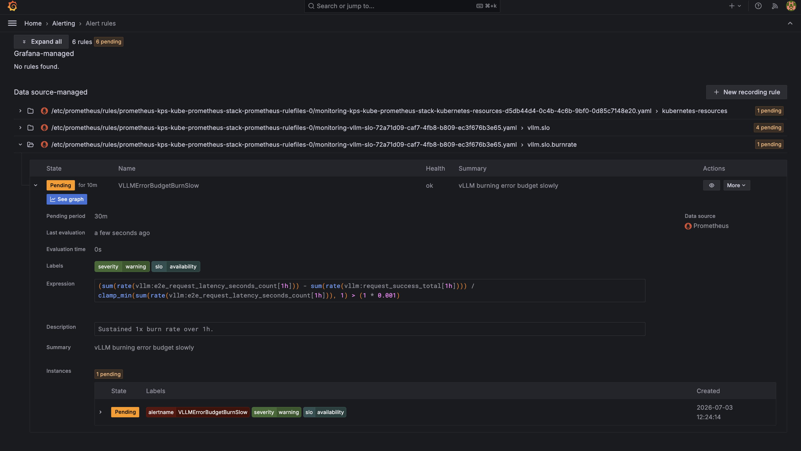

# 14 — Alerts

Prometheus alert rules live in `alerts/`. Three files, ~27 rules, grouped
by concern:

- **`vllm-slo.yaml`** — inference SLOs and multi-window burn-rate alerts
- **`gpu-health.yaml`** — hardware fault detection
- **`model-quality.yaml`** — continuous eval regression

All rules carry the label `release: kps` so Prometheus Operator picks
them up.

Live in Grafana's **Alerting → Alert rules** view. Every rule is
data-source-managed (Prometheus scrapes the `PrometheusRule` CRs, Grafana
reflects state). Example below — `VLLMErrorBudgetBurnSlow` is `Pending`
(condition true, not yet held long enough to fire) with the underlying
expression visible:



## `vllm-slo.yaml`

### Latency SLOs

| Alert | Condition | For | Severity | SLO |
|-------|-----------|-----|----------|-----|
| **VLLMHighTTFT** | p95 TTFT > 2s | 10m | warning | `ttft` |
| **VLLMHighE2ELatency** | p95 end-to-end > 10s | 10m | warning | `e2e_latency` |

Both computed with:
```promql
histogram_quantile(0.95,
  sum(rate(vllm:time_to_first_token_seconds_bucket[5m])) by (le)) > 2
```

**Runbook**: Check the vLLM dashboard for queue depth. If `waiting > 0`,
the pod is saturated → scale out (multi-GPU) or reduce request rate. If
`waiting == 0` but TTFT is still high, check GPU util (thermal throttle?).

### Saturation

| Alert | Condition | For | Severity |
|-------|-----------|-----|----------|
| **VLLMHighQueueDepth** | `waiting > 20` | 5m | warning |
| **VLLMKVCacheAlmostFull** | `gpu_cache_usage_perc > 95` | 5m | warning |
| **VLLMHighPreemptionRate** | `rate(preemptions[5m]) > 0.1` | 5m | warning |

The preemption alert is the important one: any nontrivial preemption rate
means users are seeing failed streams.

**Runbook**: Reduce `--max-num-seqs` (fewer concurrent requests), reduce
`--max-model-len` (shorter contexts), or scale out.

### Availability

| Alert | Condition | For | Severity |
|-------|-----------|-----|----------|
| **VLLMPodDown** | `kube_deployment_status_replicas_ready < 1` | 5m | **critical** |
| **VLLMCrashLooping** | `container restart rate > 0` | 5m | **critical** |
| **VLLMStartupFailing** | `Pending > 35m OR not serving > 30m` | 5m | **critical** |

**Runbook**: `kubectl -n llama describe pod ...` — image pull? OOMKilled?
CUDA error? `kubectl logs` on the previous container instance
(`--previous`).

### Quality

| Alert | Condition | For | Severity |
|-------|-----------|-----|----------|
| **VLLMHighAbortRate** | abort % > 2% | 10m | warning |
| **VLLMHighLengthTruncationRate** | `finish_reason=length` > 20% | 30m | info |

Aborts mean clients are giving up (usually client-side timeout). Length
truncations mean the model is hitting `max_tokens` — either raise the
default `max_tokens` or the users are asking for too much.

### Efficiency

| Alert | Condition | For | Severity |
|-------|-----------|-----|----------|
| **VLLMGPUUnderutilized** | SM util < 20% AND waiting > 5 | 10m | warning |

The GPU is idle but requests are queuing — usually means
`--max-num-batched-tokens` is too low, so batches don't fill up. Bump it.

### Error-budget burn (multi-window)

Following the [Google SRE Workbook, chapter 6](https://sre.google/workbook/alerting-on-slos/)
pattern. SLO target: **99.9% availability**.

| Alert | Burn window (short/long) | Threshold | For | Severity |
|-------|--------------------------|-----------|-----|----------|
| **VLLMErrorBudgetBurnFast** | 5m / 1h | > 14.4× normal error rate | 2m | **critical** |
| **VLLMErrorBudgetBurnSlow** | 30m / 6h | > 1× normal | 30m | warning |

- **Fast burn** = burning the 30-day error budget in ≤ 2 hours. Page.
- **Slow burn** = burning at the SLO rate but continuously. Non-page,
  triage in business hours.

Both use two windows to reduce false positives (a 30-second blip won't
fire either).

Formula:
```promql
(
  sum(rate(envoy_cluster_upstream_rq{envoy_cluster_name=~"llama.*",
                                    response_code_class!="2xx"}[5m])) /
  sum(rate(envoy_cluster_upstream_rq{envoy_cluster_name=~"llama.*"}[5m]))
) > (14.4 * 0.001)     # 14.4× the 0.1% error budget
and
(
  ...same for [1h]...
) > (14.4 * 0.001)
```

## `gpu-health.yaml`

Alert catalog (all namespace `monitoring`, label `release: kps`):

| Alert | Condition | For | Severity | Action |
|-------|-----------|-----|----------|--------|
| **GPUXIDError** | `increase(DCGM_FI_DEV_XID_ERRORS[5m]) > 0` | 0m | **critical** | Cordon, drain, reboot, RMA if reproducing |
| **GPUECCDoubleBitError** | `increase(DCGM_FI_DEV_ECC_DBE_VOL_TOTAL[5m]) > 0` | 0m | **critical** | Cordon, quarantine, RMA |
| **GPUHighTemperature** | `DCGM_FI_DEV_GPU_TEMP > 85` | 5m | warning | Check airflow, reduce load |
| **GPUHighMemoryUsage** | `DCGM_FI_DEV_FB_USED / total > 0.95` | 5m | warning | Reduce `--max-num-seqs`; check for KV leaks |
| **GPUThermalThrottling** | `DCGM_FI_DEV_THERMAL_VIOLATION` active | 5m | warning | See temperature |
| **GPUExporterDown** | `up{job="dcgm"}` == 0 | 10m | warning | Restart DCGM DaemonSet |

## `model-quality.yaml`

| Alert | Condition | For | Severity | Notes |
|-------|-----------|-----|----------|-------|
| **ModelQualityLowOverallPassRate** | `model_eval_pass_rate < 0.70` | 30m | warning | See the eval dashboard for which category regressed |
| **ModelQualityCategoryRegressed** | category pass rate <50% AND was ≥50% 24h ago | 1h | warning | Isolates prompt/dtype/model regressions |
| **ModelQualityEvalStale** | `time() - model_eval_last_run_timestamp > 12h` | 15m | warning | CronWorkflow failed; check `argo` ns |
| **ModelEvalLatencyHigh** | `model_eval_latency_seconds{quantile="p95"} > 15` | 30m | warning | Model degrading or over-saturated |

## Rule metadata

Every rule has:

- `severity: critical | warning | info` — for router filtering.
- `slo: <name>` — the SLO group it belongs to.
- `runbook_url: <url>` — pointing at this doc (or an incident playbook).
- `summary` and `description` — used in Alertmanager templates.

Example:
```yaml
- alert: VLLMHighTTFT
  expr: histogram_quantile(0.95, ...) > 2
  for: 10m
  labels:
    severity: warning
    slo: ttft
  annotations:
    summary: "vLLM p95 TTFT exceeded 2s"
    description: "..."
    runbook_url: "https://github.com/framsouza/inference-reliability-platform/blob/main/docs/14-alerts.md#latency-slos"
```

## Alert routing (Alertmanager)

Default install has a `null` receiver. Configure real receivers in
`apps/kube-prometheus-stack.yaml` under `alertmanager.config`.

Suggested route tree:

```yaml
route:
  receiver: default
  group_by: [alertname, severity]
  group_wait: 30s
  group_interval: 5m
  repeat_interval: 3h
  routes:
    - matchers: [severity="critical"]
      receiver: pagerduty
      continue: true
    - matchers: [severity="warning"]
      receiver: slack
    - matchers: [severity="info"]
      receiver: null
```

## Runbook links

Each alert should map to a specific action. Where "runbook" is
mentioned above, the intent is a `docs/18-operations.md#alert-<name>`
section — see [`18-operations.md`](18-operations.md) for the shape.

## Silencing (during incidents)

To silence an alert without deleting the rule:

- Via `amtool`: `amtool silence add --alertmanager.url=...  alertname=VLLMHighTTFT --duration=1h --comment="planned load test"`.
- Via Grafana: navigate to Alerting → Silences.

Silence maintenance windows (nightly load tests) explicitly — otherwise
you'll page on your own load tests.

## Extending / operating

- **New SLO** — add a rule to `alerts/vllm-slo.yaml` with `labels.slo:
  <name>`. Grafana template variables can filter by `slo`.
- **New quality dimension** — add a category to the eval prompt set
  ([`16-evals.md`](16-evals.md)) and a `ModelQualityCategory<Name>Regressed`
  alert.
- **Tighter thresholds** — after you've baselined production traffic,
  lower `VLLMHighTTFT` from 2s to 1s (or whatever matches your SLO).
- **Anomaly detection instead of thresholds** — replace fixed
  thresholds with `holt_winters` or `predict_linear` — noisier but
  catches slow drifts thresholds miss.

## Related docs

- Dashboards driving the same metrics: [`13-dashboards.md`](13-dashboards.md)
- Observability plumbing: [`12-observability.md`](12-observability.md)
- Operations runbook (deeper): [`18-operations.md`](18-operations.md)
